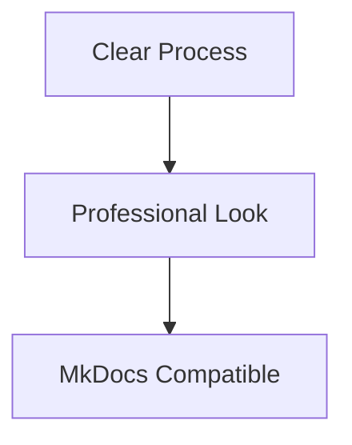

# Documentation Templates

This directory contains standardized templates for all Dashtam documentation. Using these templates ensures consistency, completeness, and makes it easier for contributors to create high-quality documentation.

---

## 📚 Available Templates

| Template | Purpose | Use For |
|----------|---------|---------|
| [general-template.md](general-template.md) | Default template for all documentation | Any doc that doesn't fit other categories |
| [architecture-template.md](architecture-template.md) | System architecture and design docs | Design patterns, system architecture, technical decisions |
| [guide-template.md](guide-template.md) | Step-by-step how-to guides | Tutorials, setup guides, how-to documentation |
| [infrastructure-template.md](infrastructure-template.md) | Infrastructure and operations docs | Docker, CI/CD, database, deployment, monitoring |
| [testing-template.md](testing-template.md) | Testing documentation | Test strategies, testing guides, QA documentation |
| [troubleshooting-template.md](troubleshooting-template.md) | Debugging and issue resolution docs | Bug investigations, root cause analysis, solutions |
| [research-template.md](research-template.md) | Research and ADR documents | Technical research, decision records, options analysis |
| [api-flow-template.md](api-flow-template.md) | API manual testing flows | User-centric API workflows for manual testing |
| [index-template.md](index-template.md) | Directory navigation pages | Navigation/index pages (docs/index.md, docs/development/index.md) |
| [readme-template.md](readme-template.md) | Feature/component READMEs | Feature documentation (env/README.md, tests/smoke/README.md) |
| [mermaid-diagram-standards.md](../development/guides/mermaid-diagram-standards.md) | **Diagram standards** | **REQUIRED: All diagrams MUST use Mermaid** |

---

## 🎯 Quick Start

### 1. Choose the Right Template

**Decision tree:**

- **Writing architecture docs?** → Use `architecture-template.md`
- **Writing how-to guide?** → Use `guide-template.md`
- **Documenting infrastructure?** → Use `infrastructure-template.md`
- **Writing test documentation?** → Use `testing-template.md`
- **Documenting a bug/issue resolution?** → Use `troubleshooting-template.md`
- **Researching options/decisions?** → Use `research-template.md`
- **Creating API flow?** → Use `api-flow-template.md`
- **Creating directory index/navigation?** → Use `index-template.md`
- **Documenting a feature/component?** → Use `readme-template.md`
- **Not sure?** → Use `general-template.md`

### 2. Copy the Template

```bash
# Copy template to your target location
cp docs/templates/guide-template.md docs/development/guides/my-new-guide.md
```

### 3. Fill Out the Template

Replace all placeholders:

- `[Bracketed text]` - Replace with your content
- `YYYY-MM-DD` - Replace with actual dates
- Keep the structure - Don't remove sections unless truly not applicable

### 4. Verify Quality

```bash
# Lint your new document
docker run --rm -v $(pwd):/workspace:ro -w /workspace node:24-alpine \
  npx markdownlint-cli2 "docs/path/to/your-new-doc.md"
```

---

## 📝 Template Structure

All templates follow this general structure:

1. **Title and Brief Description** - Clear, concise intro
2. **Horizontal Rule** - Visual separator
3. **Table of Contents** - For navigation (optional for short docs)
4. **Main Content Sections** - Template-specific content
5. **References Section** - Links to related docs
6. **Horizontal Rule** - Separator before metadata
7. **Document Information** - Metadata at bottom (MkDocs-compatible)

### Metadata Fields

All templates include standard metadata at the **bottom** of the document:

```markdown
---

## Document Information

**Category:** [Template Category]
**Created:** YYYY-MM-DD
**Last Updated:** YYYY-MM-DD

[Optional fields as needed per template]
```

**Why at the bottom?**

- Better readability for users (content first)
- MkDocs Material can extract and display metadata
- Keeps main content clean and focused

---

## ✅ Best Practices

### General Guidelines

1. **Be Concise** - Clear and direct language
2. **Use Examples** - Show, don't just tell
3. **Think User-First** - Write for your audience (end-users, developers, operators)
4. **Keep Updated** - Update Last Updated date when making changes
5. **Link Generously** - Reference related docs

### Writing Style

- ✅ Use active voice: "Run the command" not "The command should be run"
- ✅ Use present tense: "The system validates" not "The system will validate"
- ✅ Be specific: "Set timeout to 30 seconds" not "Set a reasonable timeout"
- ✅ Use code blocks: Always include language identifier (bash, python, yaml, etc.)
- ✅ Use lists: Break down complex information into bullets or numbered lists

### Markdown Quality

- ✅ Pass markdown linting (no MD warnings)
- ✅ Use proper heading hierarchy (# → ## → ### )
- ✅ Include alt text for images
- ✅ Use fenced code blocks with language tags
- ✅ No trailing spaces (use 0 or 2 for line breaks)

### Diagram Standards (REQUIRED)

- ✅ **MUST use Mermaid syntax** for diagrams (except directory trees)
- ✅ Directory trees → Use code blocks with tree structure (like `tree` command)
- ✅ Process flows → Use `flowchart TD`
- ✅ Database schemas → Use `erDiagram`
- ✅ API sequences → Use `sequenceDiagram`
- ❌ **NO image files** (PNG, JPG, SVG)
- ❌ **NO external tools** (draw.io, Lucidchart)
- 📖 **See:** [Mermaid Diagram Standards](../development/guides/mermaid-diagram-standards.md) for complete reference

---

## 📋 Metadata Standards

### Required Formatting (Updated 2025-10-15)

### Critical Formatting Rule: Use Line Breaks, NOT Inline Formatting

```markdown
# ✅ CORRECT: Line breaks between fields
## Document Information

**Category:** Guide
**Created:** 2025-10-15
**Last Updated:** 2025-10-15
**Difficulty Level:** Intermediate

# ❌ WRONG: Inline formatting with trailing spaces
**Category:** Guide  
**Created:** 2025-10-15  
**Last Updated:** 2025-10-15  
**Difficulty Level:** Intermediate  
```

**Phase 1 Discovery:** Many documents used inline formatting which causes:

- Inconsistent rendering
- Markdown linting issues  
- Poor readability
- MkDocs parsing problems

### Metadata Fields

**Required Fields:**

- **Category**: Template-specific category (Architecture, Guide, Testing, Troubleshooting, etc.)
- **Created**: Document creation date (YYYY-MM-DD)
- **Last Updated**: Last modification date (YYYY-MM-DD)

**Optional Fields** (template-specific):

- **Applies To**: Scope (Architecture template)
- **API Version**: API version (API Flow template)
- **Environment**: Target environment (Infrastructure, Troubleshooting templates)
- **Difficulty Level**: Beginner | Intermediate | Advanced (Guide template)
- **Target Audience**: Who should read this (Guide template)
- **Prerequisites**: What knowledge/tools are needed (Guide template)
- And others as needed per template

**Forbidden Fields** (discovered in Phase 1):

- ❌ **Status**: Document location indicates status (active vs historical)
- ❌ **Maintainer**: Reduces maintenance overhead, use GitHub ownership
- ❌ Any custom fields not in templates

**Why These Standards?**

- Document location indicates status (active vs historical)
- Reduces maintenance overhead
- Consistent formatting across all documents
- MkDocs Material compatibility
- Status is implied by directory structure:
  - `docs/development/*` = Active
  - `docs/development/historical/*` = Historical/Archived

---

## 📂 Where to Put Your Documentation

Follow this directory structure:

```text
docs/
├── templates/              # You are here! (don't add content docs here)
├── api-flows/              # API manual testing flows
│   ├── auth/
│   └── providers/
├── development/            # Developer documentation
│   ├── architecture/       # System architecture and design
│   ├── guides/             # How-to guides and tutorials
│   ├── historical/         # Historical/archived docs (completed work)
│   ├── implementation/     # Implementation plans (active)
│   ├── infrastructure/     # Docker, CI/CD, deployment
│   ├── research/           # Technical research (active)
│   ├── reviews/            # Code reviews, audits
│   ├── testing/            # Testing strategy and guides
│   └── troubleshooting/    # Bug investigations and resolutions
└── research/               # Research and ADRs (project-wide)
```

**Guidelines:**

- **Development docs** → `docs/development/[category]/`
- **User-facing docs** → `docs/setup/`, `docs/api/`, or `docs/guides/` (future)
- **Active research** → `docs/research/` or `docs/development/research/`
- **Completed/historical docs** → `docs/development/historical/`
- **Troubleshooting/bug investigations** → `docs/development/troubleshooting/`

---

## 🎨 Customizing Templates

Templates are meant to be guides, not straitjackets:

**OK to customize:**

- ✅ Add sections specific to your topic
- ✅ Reorder sections if it improves flow
- ✅ Remove sections that truly don't apply (rarely needed)
- ✅ Expand placeholder text with more detailed guidance

**Don't remove:**

- ❌ Document Information section (metadata)
- ❌ Title and brief description
- ❌ Core sections central to the template's purpose

---

## 🔍 Examples

### Good Documentation

See these examples of well-structured docs:

- Architecture: `docs/development/architecture/jwt-authentication.md`
- Guide: `docs/development/guides/git-workflow.md`
- Infrastructure: `docs/development/infrastructure/docker-setup.md`
- Testing: `docs/development/testing/strategy.md`
- Research: `docs/research/authentication-approaches-research.md`

### Template Usage Example

**Before (no template):**

```markdown
# My Feature

This is about my feature.

It does stuff.

## How to use

Run the command.
```

**After (using guide-template.md):**

Proper structure with:

- Clear title and description
- Organized sections (Overview, Prerequisites, Steps, etc.)
- Code blocks with commands
- Verification steps
- Troubleshooting
- Metadata at bottom:

  ```text
  ## Document Information
  
  **Status:** Active
  **Category:** Guide
  **Created:** 2025-10-13
  **Last Updated:** 2025-10-13
  ```

---

## 🚀 MkDocs Integration

These templates are designed to work seamlessly with MkDocs Material:

### Metadata Usage

The Document Information section at the bottom can be:

1. **Displayed in page footer** - MkDocs Material can extract and show metadata
2. **Used for sorting** - Sort docs by status, category, or date
3. **Used for search** - Filter docs by metadata fields
4. **Used for automation** - Generate doc indexes automatically

### Future Enhancements

When MkDocs is implemented, these templates will support:

- Automatic navigation generation
- Search by metadata fields
- Documentation versioning
- Multi-language support
- API documentation auto-generation

---

## 📋 Checklist for New Docs

When creating a new document:

- [ ] Choose appropriate template
- [ ] Copy template to correct location
- [ ] Replace all `[placeholder text]`
- [ ] Fill in metadata (Status, Created, Last Updated)
- [ ] Add examples and code samples
- [ ] Run markdown linting (`make lint-md`)
- [ ] Link from/to related documents
- [ ] Preview rendering (especially code blocks and tables)
- [ ] Commit with clear message

---

## 🆘 Need Help?

- **Questions about templates?** Check existing docs for examples
- **Not sure which template?** Start with `general-template.md`
- **Template missing something?** Propose improvements in PR
- **Documentation standards?** See WARP.md section on documentation

---

## 📈 Phase 1 Migration Learnings (2025-10-15)

### Critical Quality Issues Discovered

During Phase 1 documentation template migration (20 documents), several recurring quality issues were identified that **MUST** be addressed in future phases:

#### 1. Table of Contents Completeness ⚠️ **HIGH PRIORITY**

**Problem:** Most documents had incomplete TOCs showing only main template sections, missing:

- Subsections and nested content
- Additional sections added between template sections
- Proper hierarchy (### subsections under ## main sections)

**Example Issue:**

```markdown
# BAD: Incomplete TOC
- [Overview](#overview)
- [Prerequisites](#prerequisites)  
- [Examples](#examples)

# Document actually contains:
## Overview
### What You'll Learn    ← Missing from TOC
### When to Use         ← Missing from TOC
## Prerequisites
## Step-by-Step Instructions  ← Missing from TOC
### Step 1             ← Missing from TOC
### Step 2             ← Missing from TOC
## Examples
```

**Solution for Future Phases:**

- Generate complete TOC by analyzing all headings (##, ###, ####)
- Include proper hierarchy and nesting
- Ensure MkDocs-compatible anchor links
- Test all link fragments for validity

#### 2. ASCII/Text Diagrams → Mermaid Conversion 🎨 **HIGH PRIORITY**

**Problem:** Many documents contained ASCII/text diagrams instead of professional Mermaid diagrams.

**Examples Found:**

```markdown
# BAD: ASCII Box Diagrams
┌─────────────────────────────────────┐
│  TEXT IN BOXES                      │  
│  → arrows and connections           │
└─────────────────────────────────────┘

# GOOD: Mermaid Diagrams  


**Solution for Future Phases:**

- Convert ALL ASCII/text diagrams to appropriate Mermaid types:
  - Process flows → `flowchart TD`
  - Sequences → `sequenceDiagram`
  - Architecture → `flowchart` with styling
  - Data relationships → `erDiagram`
- Add Mermaid pattern examples to [Mermaid Diagram Standards](../development/guides/mermaid-diagram-standards.md)
- Use proper styling and colors for visual hierarchy

#### 3. Document Information Formatting 📝 **MEDIUM PRIORITY**

**Problem:** Inconsistent metadata formatting - some documents used inline formatting with trailing spaces instead of line breaks.

**Examples:**

```markdown
# BAD: Inline with trailing spaces
**Category:** Guide  
**Created:** 2025-10-15  
**Last Updated:** 2025-10-15  

# GOOD: Line breaks per template
**Category:** Guide
**Created:** 2025-10-15
**Last Updated:** 2025-10-15
```

**Solution for Future Phases:**

- Always use line breaks between metadata fields
- Never use trailing spaces for formatting
- Follow template structure exactly

#### 4. Template Compliance Issues 🔧 **MEDIUM PRIORITY**

**Discovered Issues:**

- Duplicate metadata (both in header and Document Information)
- Non-template fields added ("Maintainer", etc.)
- Inconsistent field naming

**Solution:** Strict template adherence validation

### Phase Migration Checklist

**For ALL future phases, each document MUST be checked for:**

#### Quality Standards Checklist

- [ ] **TOC Completeness**: All sections (##, ###, ####) included with proper hierarchy
- [ ] **Mermaid Diagrams**: NO ASCII/text diagrams, all converted to Mermaid
- [ ] **Document Information**: Line break formatting (not inline)
- [ ] **Template Compliance**: Only template fields, no duplicates
- [ ] **Markdown Linting**: Zero linting errors
- [ ] **Link Validation**: All internal links work

#### Recommended Migration Workflow

1. **Initial Assessment**: Scan document for above issues
2. **TOC Analysis**: Map ALL headings and create complete TOC
3. **Diagram Conversion**: Convert any ASCII/text to Mermaid
4. **Format Standardization**: Fix Document Information formatting
5. **Template Validation**: Ensure strict template compliance
6. **Quality Gates**: Lint and link validation
7. **Testing**: Verify TOC navigation works

### Tools & Commands

```bash
# Check TOC completeness
grep -n "^##" docs/path/to/file.md | head -20

# Find ASCII diagrams (common patterns)
grep -n "┌\|└\|├\|─" docs/path/to/file.md

# Check Document Information formatting
tail -10 docs/path/to/file.md

# Validate markdown
make lint-md-file FILE="docs/path/to/file.md"
```

### Success Metrics from Phase 1

- **Documents processed:** 20/20 (100%)
- **ASCII diagrams converted:** 3 major conversions (jwt-auth, token-rotation)
- **Formatting issues fixed:** 12 documents standardized
- **Template compliance:** 100% achieved
- **Linting errors:** 0 across all documents

---

## 🔄 Maintaining Templates

### When to Update Templates

- New best practices emerge
- MkDocs features require metadata changes
- Consistent patterns identified across docs
- User feedback suggests improvements

### How to Propose Changes

1. Create feature branch
2. Update template(s) with clear rationale
3. Update this README if needed
4. Create PR with examples showing improvements
5. Get review and merge

---

## Document Information

**Status:** Active
**Category:** Documentation Standards
**Created:** 2025-10-13
**Last Updated:** 2025-10-13
**Purpose:** Central guide for all documentation templates in Dashtam project
