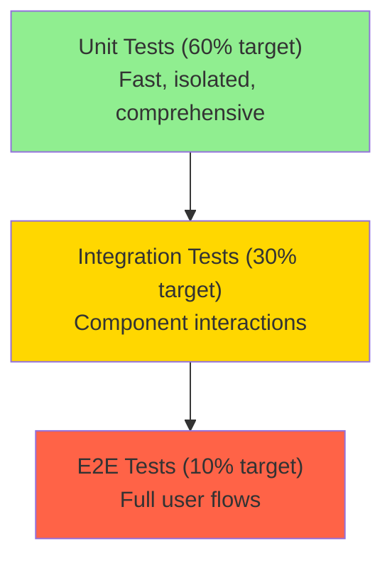

# Dashtam Testing Strategy

Comprehensive testing strategy for the Dashtam financial data aggregation platform using synchronous testing with FastAPI TestClient and SQLModel Session.

## Overview

Dashtam uses a synchronous testing strategy with FastAPI's TestClient and SQLModel's Session, following the official FastAPI template pattern. This approach avoids async complexity while maintaining comprehensive test coverage.

Current Implementation Status (October 2025):

- Synchronous testing fully implemented
- 295+ tests passing (unit, integration, API, smoke)
- 76% code coverage (target: 85%)
- Zero async/greenlet issues
- Docker-based test environment with isolated PostgreSQL
- GitHub Actions CI/CD with automated testing
- Codecov integration for coverage tracking

### Testing Goals

- Goal 1: Maintain 85%+ overall code coverage with 95%+ for critical components
- Goal 2: Keep test suite execution under 30 seconds for rapid feedback
- Goal 3: Ensure zero flaky tests through proper isolation and deterministic patterns
- Goal 4: Follow FastAPI official patterns for maintainability and community alignment

### Scope

Covered:

- Business logic and service layer code
- Database operations and CRUD functions
- API endpoints and authentication flows
- OAuth provider integrations
- Token encryption and management

Not Covered:

- Third-party API responses (mocked in tests)
- Email delivery (mocked with AWS SES)
- Production infrastructure concerns

## Testing Strategy

### Test Pyramid



Distribution:

| Test Type | Current % | Target % | Speed | Purpose |
|---|---:|---:|---|---|
| Unit | 23% | 60% | Very Fast (< 100ms) | Test individual functions/classes |
| Integration | 28% | 30% | Fast (< 500ms) | Test component interactions |
| E2E/API | 49% | 10% | Slower (< 1s) | Test complete user workflows |

Note: Current distribution is inverted from target. We need more unit tests and fewer E2E tests.

### Testing Principles

- Synchronous tests: TestClient with sync Session to avoid async complexity
- Isolation: Each test is independent with proper setup/teardown
- Clarity: Test names describe what is being tested and expected behavior
- Speed: Optimize for fast execution (target: < 30s full suite)
- Deterministic: No flaky tests; all tests should pass consistently

Architectural Decision: See Async Testing Decision (../architecture/async-testing-decision.md) for rationale on sync vs async testing choice.

## Test Types

### Unit Tests

Purpose: Test business logic without external dependencies

Characteristics:

- Fast execution (< 100ms per test)
- Isolated from external dependencies
- Test single units of code
- No database connection
- Mock all external services

When to Use:

- Testing individual functions
- Testing class methods
- Testing business logic
- Testing utility functions
- Testing encryption/decryption

Example:

```python
from src.services.encryption import EncryptionService

def test_encrypt_decrypt_cycle():
    """Test encryption and decryption works correctly."""
    service = EncryptionService()
    original = "my_secret_token"

    encrypted = service.encrypt(original)
    assert encrypted != original
    assert encrypted.startswith("gAAAAA")  # Fernet format

    decrypted = service.decrypt(encrypted)
    assert decrypted == original
```

### Integration Tests

Purpose: Test database operations and service layer interactions

Characteristics:

- Test component interactions
- Use real PostgreSQL database
- Transaction rollback for isolation
- Test CRUD operations
- Execution time < 500ms per test

When to Use:

- Testing database operations
- Testing service interactions
- Testing data relationships
- Testing transaction behavior

Example:

```python
from sqlmodel import Session
from src import crud
from src.models import ProviderCreate

def test_create_provider(db: Session, test_user):
    """Test creating a provider in database."""
    provider_in = ProviderCreate(
        user_id=test_user.id,
        provider_key="schwab",
        alias="Test Account",
    )

    provider = crud.create_provider(session=db, provider_in=provider_in)

    assert provider.id is not None
    assert provider.user_id == test_user.id
    assert provider.provider_key == "schwab"
```

### End-to-End Tests

Purpose: Test complete request/response cycle through API

Characteristics:

- Test complete user flows
- Use FastAPI's TestClient
- Test authentication flows
- Test error handling
- Execution time < 1s per test

When to Use:

- Critical user journeys
- Auth flows
- API workflows
- OAuth integrations

Example:

```python
from fastapi.testclient import TestClient

def test_create_provider_endpoint(
    client: TestClient,
    superuser_token_headers: dict[str, str],
):
    """Test POST /api/v1/providers/ endpoint."""
    data = {
        "provider_key": "schwab",
        "alias": "My Schwab Account",
    }

    response = client.post(
        "/api/v1/providers/",
        headers=superuser_token_headers,
        json=data,
    )

    assert response.status_code == 200
    content = response.json()
    assert content["provider_key"] == "schwab"
```

## Setup

### Prerequisites

- Docker and Docker Compose installed
- Python 3.13+ with UV package manager
- Test database configured (PostgreSQL)
- Environment variables set (.env.test file)

### Test Environment Setup

Start test environment:

```bash
make test-up
```

Run tests:

```bash
make test
```

Stop test environment:

```bash
make test-down
```

Test Fixtures (tests/conftest.py):

Core fixtures provide database session, TestClient, and authentication:

```python
from collections.abc import Generator
import pytest
from fastapi.testclient import TestClient
from sqlmodel import Session

@pytest.fixture(scope="session", autouse=True)
def db() -> Generator[Session, None, None]:
    """Session-scoped database fixture."""
    # Create tables, yield session, cleanup
    yield session

@pytest.fixture(scope="function")
def db_session(db: Session) -> Generator[Session, None, None]:
    """Function-scoped session for test isolation."""
    yield db

@pytest.fixture(scope="module")
def client() -> Generator[TestClient, None, None]:
    """Test client for API requests."""
    with TestClient(app) as c:
        yield c
```

### Test Data

- Test Fixtures: Defined in tests/conftest.py and test-specific conftest.py files
- Test User: Created automatically via init_db() function
- Test Providers: Created per-test as needed for isolation

## Writing Tests

### Test Structure

```python
def test_feature_name():
    """Test description following Google style docstrings.

    This test verifies [specific behavior].
    """
    # Arrange - Set up test data
    test_data = setup_test_data()

    # Act - Execute the code under test
    result = function_under_test(test_data)

    # Assert - Verify the results
    assert result == expected_value
```

### Naming Conventions

- Test files: test_<module>.py
- Test functions: test_<feature>_<scenario>()
- Test classes: Test<Component>

Examples:

- test_user_registration_with_valid_email()
- test_token_refresh_when_expired()
- Avoid: test1(), testUserStuff()

### Fixtures

```python
import pytest

@pytest.fixture
def sample_fixture():
    """Description of what this fixture provides."""
    # Setup
    data = create_test_data()
    yield data
    # Teardown (if needed)
    cleanup(data)
```

See: Test Docstring Standards (../guides/test-docstring-standards.md) for comprehensive fixture documentation guidelines.

## Running Tests

### Run All Tests

```bash
# Full test suite
make test

# Alternative: Direct pytest (in container)
docker compose -f compose/docker-compose.test.yml exec app \
  uv run pytest tests/ -v
```

### Run Specific Tests

```bash
# Run unit tests (fast)
make test-unit

# Run integration tests
make test-integration

# Run smoke tests (end-to-end auth flows)
make test-smoke

# Single test file
pytest tests/test_module.py

# Single test function
pytest tests/test_module.py::test_specific_function

# Tests matching pattern
pytest -k "test_user"
```

### Run with Coverage

```bash
# With coverage report
make test-coverage

# Alternative: Direct pytest with coverage
docker compose -f compose/docker-compose.test.yml exec app \
  uv run pytest --cov=src --cov-report=html tests/
```

### Run in Docker

```bash
# Start test environment
make test-up

# Run tests in container
docker compose -f compose/docker-compose.test.yml exec app \
  uv run pytest tests/ -v

# With coverage
docker compose -f compose/docker-compose.test.yml exec app \
  uv run pytest --cov=src --cov-report=html tests/
```

## Coverage

### Coverage Goals

- Overall Target: 85%
- Critical Components: 95%+ (authentication, token management, encryption)
- New Code: 100%
- Current Coverage: 76% (Phase 1 baseline)

### Checking Coverage

```bash
# Generate coverage report
make test-coverage

# HTML coverage report (opens in browser)
pytest --cov=src --cov-report=html tests/
open htmlcov/index.html
```

Coverage Configuration (pyproject.toml):

```toml
[tool.coverage.run]
source = ["src"]
omit = [
    "src/migrations/*",
    "tests/*",
]

[tool.coverage.report]
exclude_lines = [
    "pragma: no cover",
    "def __repr__",
    "raise AssertionError",
    "raise NotImplementedError",
    "if __name__ == .__main__.:",
    "if TYPE_CHECKING:",
]
```

## Best Practices

### General Principles

- Write tests first (TDD) when possible
- One assertion per test: keep tests focused on single behavior
- Independent tests: no inter-test dependencies
- Clear names: describe what is tested and expected
- Fast tests: optimize for speed, especially unit tests
- Deterministic: no random/time dependencies without mocking

### Testing Anti-Patterns to Avoid

- Testing implementation details: test behavior, not internals
- Flaky tests: avoid non-determinism
- Slow tests: keep unit tests under 100ms
- Large fixtures/data: use minimal data
- Shared mutable state: isolate per test

## Common Patterns

### Pattern 1: Unit Test Example

```python
# tests/unit/services/test_encryption_service.py
from src.services.encryption import EncryptionService

def test_encrypt_decrypt_cycle():
    """Test encryption and decryption works correctly."""
    service = EncryptionService()
    original = "my_secret_token"

    encrypted = service.encrypt(original)
    assert encrypted != original
    assert encrypted.startswith("gAAAAA")  # Fernet format

    decrypted = service.decrypt(encrypted)
    assert decrypted == original
```

### Pattern 2: Integration Test Example

```python
# tests/integration/crud/test_provider_crud.py
from sqlmodel import Session
from src import crud
from src.models import ProviderCreate

def test_create_provider(db: Session, test_user):
    """Test creating a provider in database."""
    provider_in = ProviderCreate(
        user_id=test_user.id,
        provider_key="schwab",
        alias="Test Account",
    )

    provider = crud.create_provider(session=db, provider_in=provider_in)

    assert provider.id is not None
    assert provider.user_id == test_user.id
    assert provider.provider_key == "schwab"

    # Verify in database
    db_provider = db.get(Provider, provider.id)
    assert db_provider is not None
    assert db_provider.alias == "Test Account"
```

### Pattern 3: API Test Example

```python
# tests/api/routes/test_providers.py
from fastapi.testclient import TestClient

def test_create_provider_endpoint(
    client: TestClient,
    superuser_token_headers: dict[str, str],
):
    """Test POST /api/v1/providers/ endpoint."""
    data = {
        "provider_key": "schwab",
        "alias": "My Schwab Account",
    }

    response = client.post(
        "/api/v1/providers/",
        headers=superuser_token_headers,
        json=data,
    )

    assert response.status_code == 200
    content = response.json()
    assert content["provider_key"] == "schwab"
    assert content["alias"] == "My Schwab Account"
    assert "id" in content
```

## Troubleshooting

### Issue 1: Tests Failing Intermittently

Cause: Shared state or race conditions

Solution:

- Ensure test isolation with proper fixtures
- Use fresh fixtures per test
- Avoid global state
- Check for time-dependent code

### Issue 2: Slow Tests

Cause: Too many integration tests or inefficient setup

Solution:

```bash
# Profile slow tests
pytest --durations=10

# Optimize fixtures (use session scope where safe)
# Convert integration tests to unit tests where possible
# Optionally use in-memory SQLite for very fast unit-level DB tests
```

### Issue 3: Coverage Not Accurate

Cause: Missing source files or incorrect paths

Solution:

Check pytest.ini or .coveragerc configuration for correct source paths:

```ini
[pytest]
testpaths = tests

[tool.coverage.run]
source = ["src"]
```

## References

- Testing Guide (guide.md)
- Testing Best Practices (../guides/testing-best-practices.md)
- Test Docstring Standards (../guides/test-docstring-standards.md)
- Async Testing Decision (../architecture/async-testing-decision.md)
- Async Testing Migration (../historical/async-to-sync-testing-migration.md)
- FastAPI Testing Documentation: https://fastapi.tiangolo.com/tutorial/testing/
- Pytest Documentation: https://docs.pytest.org/
- SQLModel Testing Guide: https://sqlmodel.tiangolo.com/tutorial/testing/

---

## Document Information

**Template:** [testing-template.md](../templates/testing-template.md)
**Created:** 2025-10-03
**Last Updated:** 2025-10-20
