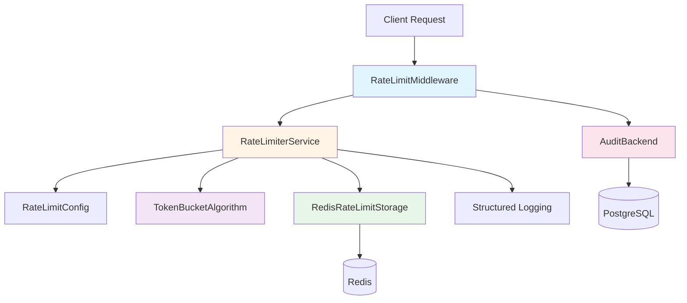
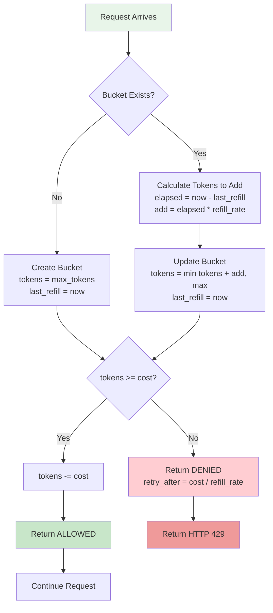
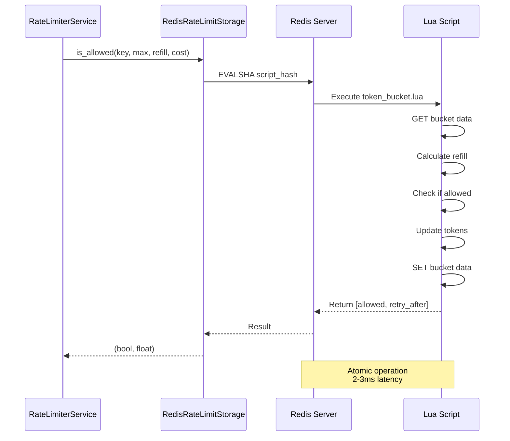

# Rate Limiting Architecture

Comprehensive overview of the Dashtam rate limiting system, including components, algorithms, storage, and audit trail.

---

## Overview

The Dashtam rate limiting system is a production-ready, distributed rate limiter built with FastAPI middleware, Redis storage, and PostgreSQL audit logging. It enforces per-endpoint request limits to protect API resources from abuse while maintaining high performance and reliability.

### Why This Approach?

The architecture prioritizes:

- **Fail-open design**: System degradation never blocks legitimate traffic
- **Distributed state**: Redis enables rate limiting across multiple app instances
- **Audit trail**: PostgreSQL provides permanent record for security analysis
- **Performance**: Token bucket algorithm with atomic Lua scripts (2-3ms p95 latency)
- **Observability**: Structured logging with rich metrics for monitoring

## Context

The rate limiting system operates within the Dashtam financial data aggregation platform, protecting API endpoints from:

- Brute force attacks on authentication endpoints (IP-scoped limits)
- API abuse from authenticated users (user-scoped limits)
- Provider API rate limit exhaustion (user-per-provider scoped limits)

**Business Requirements:**

- Protect authentication endpoints (5 requests/minute per IP)
- Limit API access per user (100 requests/minute)
- Prevent Schwab API quota exhaustion (100 requests/minute per user per provider)
- Maintain audit trail for compliance and security analysis
- Never block requests due to rate limiter failures

## Architecture Goals

- **Reliability**: Fail-open at all layers (algorithm, storage, audit, middleware)
- **Performance**: Sub-5ms rate limit checks with atomic operations
- **Scalability**: Distributed state supports horizontal scaling
- **Observability**: Complete visibility into rate limit violations and system health
- **Maintainability**: SOLID principles, DDD bounded context, comprehensive tests

## Design Decisions

### Decision 1: Token Bucket Algorithm

**Rationale:** Token bucket provides smooth rate limiting with burst capacity, preventing false positives while still protecting resources.

**Alternatives Considered:**

- **Fixed Window**: Prone to boundary burst attacks (rejected)
- **Sliding Window Log**: High memory overhead for tracking timestamps (rejected)
- **Leaky Bucket**: No burst capacity, too restrictive for API usage (rejected)

**Trade-offs:**

- ✅ Pros: Burst capacity, smooth refills, memory efficient (2 values per key)
- ✅ Pros: Industry standard (used by AWS, Stripe, GitHub)
- ⚠️ Cons: Slightly more complex than fixed window

### Decision 2: Redis for State Storage

**Rationale:** Redis provides distributed, atomic operations with excellent performance characteristics for rate limiting.

**Alternatives Considered:**

- **In-memory (dict)**: Not distributed, lost on restart (rejected)
- **PostgreSQL**: Too slow for high-frequency checks (rejected)
- **Memcached**: No Lua scripting for atomic operations (rejected)

**Trade-offs:**

- ✅ Pros: Atomic Lua scripts, persistence, distributed, 2-3ms latency
- ✅ Pros: Built-in TTL for automatic cleanup
- ⚠️ Cons: Additional infrastructure dependency

### Decision 3: PostgreSQL Audit Logs

**Rationale:** Immutable audit trail required for security analysis, compliance, and attack pattern detection.

**Alternatives Considered:**

- **Logs only**: Not queryable, no retention guarantees (rejected)
- **Redis TTL**: Data loss on eviction (rejected)

**Trade-offs:**

- ✅ Pros: Queryable, indexed, permanent record, SQL analytics
- ✅ Pros: Foreign key to users table for authenticated requests
- ⚠️ Cons: Additional write load (mitigated by fail-open + async)

### Decision 4: FastAPI Middleware Integration

**Rationale:** Middleware intercepts all requests before routing, enabling centralized rate limiting without endpoint modifications.

**Alternatives Considered:**

- **Dependency injection per endpoint**: Requires manual configuration for each endpoint (rejected)
- **Decorator pattern**: Not idiomatic for FastAPI, harder to test (rejected)

**Trade-offs:**

- ✅ Pros: Centralized, automatic coverage, easy to disable
- ✅ Pros: Runs before endpoint code (protects resources)
- ⚠️ Cons: Slight overhead on all requests (mitigated by <5ms check time)

## Components

### Component Architecture



### Component 1: RateLimitMiddleware

**Purpose:** Intercepts all HTTP requests and enforces rate limits before endpoint execution.

**Responsibilities:**

- Extract endpoint key from request path and method
- Determine identifier (user ID from JWT or IP address)
- Call rate limiter service to check if request is allowed
- Return HTTP 429 if rate limited
- Add rate limit headers to successful responses
- Audit rate limit violations to database

**Interfaces:**

- Input: HTTP Request (FastAPI Request object)
- Output: HTTP Response (429 if rate limited, otherwise from endpoint)

**Dependencies:**

- RateLimiterService: Rate limit enforcement
- JWTService: Extract user ID from access tokens
- DatabaseAuditBackend: Log violations to PostgreSQL

### Component 2: RateLimiterService

**Purpose:** Orchestrates rate limiting decisions by coordinating configuration, algorithm, and storage.

**Responsibilities:**

- Look up rate limit rule for endpoint
- Build storage key based on scope (ip, user, user_provider)
- Delegate token bucket checks to algorithm
- Measure execution time for observability
- Log structured events (allowed, blocked, fail-open)
- Return decision with retry_after value

**Interfaces:**

- Input: (endpoint: str, identifier: str, cost: int) → (allowed: bool, retry_after: float, rule: RateLimitRule)
- Output: Rate limit decision tuple

**Dependencies:**

- RateLimitConfig: Rule lookup
- TokenBucketAlgorithm: Rate limit algorithm implementation
- RedisRateLimitStorage: Distributed state storage

### Component 3: TokenBucketAlgorithm

**Purpose:** Implements token bucket rate limiting algorithm with smooth refills and burst capacity.

**Responsibilities:**

- Calculate tokens to add based on elapsed time
- Check if sufficient tokens available for request
- Consume tokens if allowed
- Calculate retry_after if denied
- Maintain max_tokens capacity (no overflow)

**Interfaces:**

- Input: (key, max_tokens, refill_rate, cost) → (allowed: bool, retry_after: float)
- Output: Rate limit decision

**Dependencies:**

- RedisRateLimitStorage: Atomic read-modify-write operations

### Component 4: RedisRateLimitStorage

**Purpose:** Provides atomic, distributed storage operations for rate limit buckets using Redis.

**Responsibilities:**

- Execute Lua scripts for atomic token bucket updates
- Store bucket state (tokens, last_refill_time)
- Provide TTL-based automatic cleanup
- Handle connection failures gracefully (fail-open)

**Interfaces:**

- Input: (key, max_tokens, refill_rate, cost) → (allowed: bool, retry_after: float)
- Output: Rate limit decision from atomic Lua script

**Dependencies:**

- Redis: Distributed key-value store
- token_bucket.lua: Atomic token bucket logic

### Token Bucket Algorithm Flow



### Storage Layer (Redis Lua)



### Component 5: DatabaseAuditBackend

**Purpose:** Logs all rate limit violations to PostgreSQL for security analysis and compliance.

**Responsibilities:**

- Create immutable audit log records
- Extract user_id and ip_address from identifiers
- Create fresh database session per violation
- Fail-open on database errors (never block requests)
- Log structured events for observability

**Interfaces:**

- Input: (ip_address, endpoint, rule_name, limit, window_seconds, violation_count, user_id?)
- Output: None (async, fire-and-forget with error logging)

**Dependencies:**

- PostgreSQL: Persistent audit trail storage
- AsyncSession: Per-request database session

### Component 6: RateLimitConfig

**Purpose:** Single source of truth (SSOT) for all rate limit rules and settings.

**Responsibilities:**

- Define rate limit rules per endpoint
- Map endpoint keys to rules
- Provide global settings (algorithm, storage backend, fail-open)
- Support different scopes (ip, user, user_provider)

**Interfaces:**

- Input: endpoint_key: str
- Output: RateLimitRule | None

**Dependencies:**

- None (pure configuration)

## Implementation Details

### Key Patterns Used

- **Strategy Pattern**: Algorithm abstraction (TokenBucketAlgorithm implements RateLimitAlgorithm interface)
- **Strategy Pattern**: Storage abstraction (RedisRateLimitStorage implements RateLimitStorage interface)
- **Strategy Pattern**: Audit abstraction (DatabaseAuditBackend implements AuditBackend interface)
- **Dependency Injection**: Service receives algorithm and storage dependencies
- **Single Responsibility**: Each component has one reason to change
- **Fail-Open**: Multi-layer error handling (algorithm, storage, audit, middleware)
- **SOLID Principles**: All 5 principles explicitly followed

### Code Organization

```text
src/rate_limiting/
├── __init__.py              # Public API exports
├── config.py                # RateLimitConfig (SSOT)
├── service.py               # RateLimiterService (orchestrator)
├── middleware.py            # RateLimitMiddleware (FastAPI integration)
├── factory.py               # Dependency injection factory
├── models.py                # RateLimitAuditLog SQLModel
├── algorithms/
│   ├── __init__.py
│   ├── base.py              # RateLimitAlgorithm interface
│   └── token_bucket.py      # TokenBucketAlgorithm implementation
├── storage_backends/
│   ├── __init__.py
│   ├── base.py              # RateLimitStorage interface
│   ├── redis_storage.py     # RedisRateLimitStorage implementation
│   └── scripts/
│       └── token_bucket.lua # Atomic Lua script
├── audit_backends/
│   ├── __init__.py
│   ├── base.py              # AuditBackend interface
│   └── database.py          # DatabaseAuditBackend implementation
└── tests/
    ├── conftest.py          # Shared fixtures
    ├── test_config.py       # Configuration tests
    ├── test_token_bucket.py # Algorithm tests
    ├── test_redis_storage.py# Storage tests
    ├── test_service.py      # Service tests
    └── test_audit_backend.py# Audit tests
```

### Configuration

**Environment Variables:**

- `REDIS_HOST`: Redis hostname (default: "redis")
- `REDIS_PORT`: Redis port (default: 6379)
- `DATABASE_URL`: PostgreSQL connection string
- `SECRET_KEY`: JWT verification key

**Rate Limit Rules (src/rate_limiting/config.py):**

```python
RULES = {
    "POST /api/v1/auth/login": RateLimitRule(
        scope="ip",
        max_tokens=5,
        refill_rate=5.0,  # 5 tokens per minute
    ),
    "GET /api/v1/providers": RateLimitRule(
        scope="user",
        max_tokens=100,
        refill_rate=100.0,  # 100 tokens per minute
    ),
    "schwab_api": RateLimitRule(
        scope="user_provider",
        max_tokens=100,
        refill_rate=100.0,
    ),
}
```

## Security Considerations

### Threats Addressed

- **Brute Force Attacks**: IP-scoped rate limits on auth endpoints (5/min)
- **API Abuse**: User-scoped rate limits on all authenticated endpoints (100/min)
- **Provider Quota Exhaustion**: User-per-provider limits for external APIs (100/min)
- **DDoS Amplification**: Rate limits prevent API as attack vector

### Security Best Practices

- **Audit Trail**: All violations logged with IP, endpoint, user_id, timestamp
- **Fail-Open**: Rate limiter failures never create denial-of-service
- **Immutable Logs**: Audit records cannot be modified or deleted
- **JWT Validation**: User ID extracted securely from validated access tokens
- **Timezone Awareness**: All timestamps in UTC (TIMESTAMPTZ) for compliance

## Performance Considerations

### Performance Characteristics

- **Rate Limit Check Latency**: 2-3ms p95 (Redis Lua script execution)
- **Memory per Bucket**: ~100 bytes (2 values: tokens, last_refill)
- **Audit Log Write**: Async, non-blocking (fail-open on errors)
- **Middleware Overhead**: <5ms per request (check + headers)

### Optimization Strategies

- **Atomic Lua Scripts**: Single Redis roundtrip for read-modify-write
- **Key TTL**: Automatic cleanup of inactive buckets (2x window duration)
- **Lazy Middleware Init**: Rate limiter created on first request (not at startup)
- **Per-Request Audit Sessions**: Fresh database session per violation (no shared state)

## Testing Strategy

### Unit Tests

- **Config**: 25 tests covering rule validation and lookup
- **Token Bucket Algorithm**: 8 tests covering refill, denial, burst
- **Redis Storage**: Integration tests with real Redis instance
- **Service**: 13 tests covering orchestration and fail-open
- **Audit Backend**: 8 tests covering persistence and timezone awareness

### Integration Tests

- **Middleware**: Tests verifying end-to-end rate limiting flow
- **Audit Logging**: Tests verifying database writes on violations
- **Multi-Endpoint**: Tests verifying independent rate limits per endpoint

### End-to-End Tests

- **API Tests**: Full HTTP request flow with rate limit enforcement
- **Smoke Tests**: Critical path validation (registration, login, rate limit)

## Future Enhancements

- **Distributed Rate Limiting**: Redis Cluster support for higher scale
- **Dynamic Rule Updates**: Hot-reload configuration without restart
- **Rate Limit Dashboard**: Admin UI for viewing violations and adjusting limits
- **Machine Learning**: Anomaly detection for adaptive rate limiting
- **Circuit Breaker**: Automatic backoff for misbehaving clients

## References

- [Rate Limiting Audit Trail Architecture](rate-limiting-audit.md)
- [Rate Limiting Request Flow](rate-limiting-request-flow.md)
- [Rate Limiting Observability](rate-limiting-observability.md)
- [Rate Limiting Implementation Guide](../implementation/rate-limiting-implementation.md)
- [Token Bucket Algorithm (Wikipedia)](https://en.wikipedia.org/wiki/Token_bucket)

---

## Document Information

**Created:** 2025-10-26
**Last Updated:** 2025-10-26
