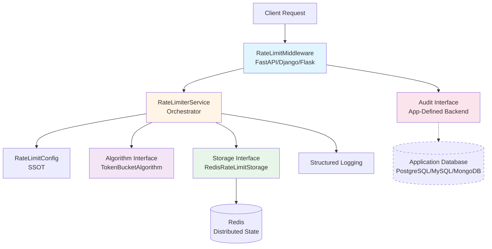

# Rate Limiter Architecture

A production-ready, database-agnostic rate limiting package for Python web applications with token bucket algorithm, distributed Redis storage, and pluggable audit backends.

---

## Overview

The Rate Limiter is a standalone, reusable package that provides distributed rate limiting for API endpoints. It implements the token bucket algorithm for smooth rate limiting with burst capacity, uses Redis for distributed state management, and offers a pluggable audit backend system that works with any database.

### Why This Approach?

The architecture prioritizes:

- **Database Agnostic**: Works with any database (PostgreSQL, MySQL, MongoDB, SQLite) or ORM (SQLModel, Django, SQLAlchemy, none)
- **Fail-Open Design**: System degradation never blocks legitimate traffic
- **Distributed State**: Redis enables rate limiting across multiple application instances
- **Pluggable Audit**: Abstract audit backend supports any storage implementation
- **Performance**: Token bucket algorithm with atomic Lua scripts (2-3ms p95 latency)
- **Portable**: Zero coupling to specific application frameworks or databases

## Context

The Rate Limiter package is designed to be embedded in web applications (FastAPI, Django, Flask, etc.) to protect API resources from abuse. It addresses common scenarios:

- Brute force attacks on authentication endpoints (IP-scoped limits)
- API abuse from authenticated users (user-scoped limits)
- Rate limit enforcement per user-per-resource (composite scoping)
- Compliance requirements for audit trails

**Key Requirements:**

- Protect endpoints with configurable rate limits
- Support multiple scoping strategies (IP, user, custom identifiers)
- Maintain audit trail for security analysis
- Never block requests due to rate limiter failures (fail-open)
- Work with any database or ORM (zero coupling)

## Architecture Goals

- **Portability**: Zero dependencies on specific databases, ORMs, or application frameworks
- **Reliability**: Fail-open at all layers (algorithm, storage, audit, middleware)
- **Performance**: Sub-5ms rate limit checks with atomic operations
- **Scalability**: Distributed state supports horizontal scaling
- **Observability**: Complete visibility into rate limit violations and system health
- **Maintainability**: SOLID principles, DDD bounded context, comprehensive tests

## Design Decisions

### Decision 1: Token Bucket Algorithm

**Rationale:** Token bucket provides smooth rate limiting with burst capacity, preventing false positives while still protecting resources.

**Alternatives Considered:**

- **Fixed Window**: Prone to boundary burst attacks (rejected)
- **Sliding Window Log**: High memory overhead for tracking timestamps (rejected)
- **Leaky Bucket**: No burst capacity, too restrictive for API usage (rejected)

**Trade-offs:**

- ✅ Pros: Burst capacity, smooth refills, memory efficient (2 values per key)
- ✅ Pros: Industry standard (used by AWS, Stripe, GitHub)
- ⚠️ Cons: Slightly more complex than fixed window

### Decision 2: Redis for State Storage

**Rationale:** Redis provides distributed, atomic operations with excellent performance characteristics for rate limiting.

**Alternatives Considered:**

- **In-memory (dict)**: Not distributed, lost on restart (rejected)
- **Database storage**: Too slow for high-frequency checks (rejected)
- **Memcached**: No Lua scripting for atomic operations (rejected)

**Trade-offs:**

- ✅ Pros: Atomic Lua scripts, persistence, distributed, 2-3ms latency
- ✅ Pros: Built-in TTL for automatic cleanup
- ⚠️ Cons: Additional infrastructure dependency

### Decision 3: Database-Agnostic Audit Backend

**Rationale:** Applications have diverse database requirements. Abstract interface allows any application to implement audit logging with their chosen database.

**Alternatives Considered:**

- **Hardcode PostgreSQL**: Couples package to specific database (rejected)
- **No audit trail**: Insufficient for security/compliance needs (rejected)
- **Logs only**: Not queryable, no retention guarantees (rejected)

**Trade-offs:**

- ✅ Pros: Works with any database (PostgreSQL, MySQL, MongoDB, SQLite)
- ✅ Pros: Works with any ORM (SQLModel, Django ORM, SQLAlchemy, none)
- ✅ Pros: Applications control their own data models
- ⚠️ Cons: Applications must implement audit backend (simple interface)

### Decision 4: Dependency Injection for All Components

**Rationale:** Enables testing with mocks, swapping implementations, and zero coupling between layers.

**Alternatives Considered:**

- **Hard-coded implementations**: Not testable, not pluggable (rejected)
- **Service locator pattern**: Global state, hard to test (rejected)

**Trade-offs:**

- ✅ Pros: Fully testable with mocks, swappable implementations
- ✅ Pros: SOLID compliant (Dependency Inversion Principle)
- ⚠️ Cons: Slightly more verbose initialization

## Components

### Component Architecture



### Component 1: RateLimiterService

**Purpose:** Orchestrates rate limiting decisions by coordinating configuration, algorithm, and storage.

**Responsibilities:**

- Look up rate limit rule for endpoint
- Build storage key based on scope (IP, user, custom identifiers)
- Delegate token bucket checks to algorithm
- Measure execution time for observability
- Log structured events (allowed, blocked, fail-open)
- Return decision with retry_after value

**Interfaces:**

- Input: `(endpoint: str, identifier: str, cost: int) → (allowed: bool, retry_after: float, rule: RateLimitRule)`
- Output: Rate limit decision tuple

**Dependencies:**

- `RateLimitConfig`: Rule lookup
- `RateLimitAlgorithm`: Rate limit algorithm implementation (strategy pattern)
- `RateLimitStorage`: Distributed state storage (strategy pattern)

### Component 2: RateLimitAlgorithm (Interface)

**Purpose:** Abstract interface for rate limiting algorithms. Implementations provide specific algorithms (token bucket, sliding window, etc.).

**Responsibilities:**

- Check if request is allowed given rate limit rules
- Update state atomically
- Calculate retry_after for denied requests
- Fail-open on errors

**Interfaces:**

- Input: `(key: str, max_tokens: int, refill_rate: float, cost: int) → (allowed: bool, retry_after: float)`
- Output: Rate limit decision

**Dependencies:**

- `RateLimitStorage`: State persistence (injected)

### Component 3: TokenBucketAlgorithm (Implementation)

**Purpose:** Implements token bucket rate limiting algorithm with smooth refills and burst capacity.

**Responsibilities:**

- Calculate tokens to add based on elapsed time
- Check if sufficient tokens available for request
- Consume tokens if allowed
- Calculate retry_after if denied
- Maintain max_tokens capacity (no overflow)

**Interfaces:**

- Implements `RateLimitAlgorithm` interface

**Dependencies:**

- `RateLimitStorage`: Atomic read-modify-write operations

### Component 4: RateLimitStorage (Interface)

**Purpose:** Abstract interface for distributed state storage. Implementations provide storage backends (Redis, etc.).

**Responsibilities:**

- Store rate limit bucket state atomically
- Execute atomic read-modify-write operations
- Provide TTL-based automatic cleanup
- Fail-open on connection errors

**Interfaces:**

- Input: `(key: str, max_tokens: int, refill_rate: float, cost: int) → (allowed: bool, retry_after: float)`
- Output: Rate limit decision from atomic operation

**Dependencies:**

- Storage backend (Redis, Memcached, etc.)

### Component 5: RedisRateLimitStorage (Implementation)

**Purpose:** Provides atomic, distributed storage operations for rate limit buckets using Redis Lua scripts.

**Responsibilities:**

- Execute Lua scripts for atomic token bucket updates
- Store bucket state (tokens, last_refill_time)
- Provide TTL-based automatic cleanup
- Handle connection failures gracefully (fail-open)

**Interfaces:**

- Implements `RateLimitStorage` interface

**Dependencies:**

- Redis: Distributed key-value store
- `token_bucket.lua`: Atomic token bucket logic

### Component 6: AuditBackend (Interface)

**Purpose:** Abstract interface for audit logging. Applications implement this to log violations to their database of choice.

**Responsibilities:**

- Log rate limit violations
- Accept flexible identifier format (app-defined)
- Fail-open on errors (never block requests)
- Support async operations

**Interfaces:**

- Input: `(identifier: str, ip_address: str, endpoint: str, rule_name: str, limit: int, window_seconds: int, violation_count: int)`
- Output: None (fire-and-forget with error logging)

**Dependencies:**

- None (applications provide their own database/ORM)

### Component 7: RateLimitConfig

**Purpose:** Single source of truth (SSOT) for all rate limit rules and settings.

**Responsibilities:**

- Define rate limit rules per endpoint
- Map endpoint keys to rules
- Provide global settings (default algorithm, storage backend)
- Support different scopes (ip, user, custom identifiers)

**Interfaces:**

- Input: `endpoint_key: str`
- Output: `RateLimitRule | None`

**Dependencies:**

- None (pure configuration)

## Implementation Details

### Key Patterns Used

- **Strategy Pattern**: Algorithm abstraction (`TokenBucketAlgorithm` implements `RateLimitAlgorithm` interface)
- **Strategy Pattern**: Storage abstraction (`RedisRateLimitStorage` implements `RateLimitStorage` interface)
- **Strategy Pattern**: Audit abstraction (applications implement `AuditBackend` interface)
- **Dependency Injection**: Service receives algorithm and storage dependencies
- **Single Responsibility**: Each component has one reason to change
- **Fail-Open**: Multi-layer error handling (algorithm, storage, audit)
- **SOLID Principles**: All 5 principles explicitly followed
- **DDD Bounded Context**: Zero coupling to application code

### Code Organization

```text
src/rate_limiter/
├── __init__.py              # Public API exports
├── config.py                # RateLimitConfig (SSOT)
├── service.py               # RateLimiterService (orchestrator)
├── middleware.py            # Framework integration examples
├── factory.py               # Dependency injection factory
├── algorithms/
│   ├── __init__.py
│   ├── base.py              # RateLimitAlgorithm interface
│   └── token_bucket.py      # TokenBucketAlgorithm implementation
├── storage/
│   ├── __init__.py
│   ├── base.py              # RateLimitStorage interface
│   ├── redis_storage.py     # RedisRateLimitStorage implementation
│   └── scripts/
│       └── token_bucket.lua # Atomic Lua script
├── audit_backends/
│   ├── __init__.py
│   ├── base.py              # AuditBackend interface
│   └── database.py          # Database-agnostic implementation
├── models/
│   ├── __init__.py
│   └── base.py              # RateLimitAuditLogBase interface
├── tests/                   # Bounded context unit tests (mocks)
│   ├── conftest.py          # Test fixtures
│   ├── test_config.py       # Configuration tests
│   ├── test_token_bucket.py # Algorithm tests
│   ├── test_redis_storage.py# Storage tests
│   ├── test_service.py      # Service tests
│   └── test_audit_backend.py# Audit tests
└── docs/                    # Package-level documentation
    ├── architecture.md      # This file
    ├── audit.md             # Audit backend implementation guide
    ├── observability.md     # Monitoring and logging
    └── request-flow.md      # Request flow diagrams
```

### Configuration

**Example Rate Limit Rules:**

```python
from rate_limiter.config import RateLimitConfig, RateLimitRule, RateLimitStrategy

RULES = {
    "POST /api/v1/auth/login": RateLimitRule(
        strategy=RateLimitStrategy.TOKEN_BUCKET,
        storage=RateLimitStorage.REDIS,
        scope="ip",
        max_tokens=20,
        refill_rate=5.0,  # 5 tokens per minute
        enabled=True,
    ),
    "GET /api/v1/users": RateLimitRule(
        strategy=RateLimitStrategy.TOKEN_BUCKET,
        storage=RateLimitStorage.REDIS,
        scope="user",
        max_tokens=100,
        refill_rate=100.0,  # 100 tokens per minute
        enabled=True,
    ),
}
```

**Example Audit Backend Implementation (Application-Defined):**

```python
from rate_limiter.audit_backends.base import AuditBackend
from my_app.models import RateLimitAuditLog  # Your model

class MyAuditBackend(AuditBackend):
    def __init__(self, session):
        self.session = session
        
    async def log_violation(
        self,
        identifier: str,
        ip_address: str,
        endpoint: str,
        rule_name: str,
        limit: int,
        window_seconds: int,
        violation_count: int,
    ):
        try:
            log = RateLimitAuditLog(
                identifier=identifier,
                ip_address=ip_address,
                endpoint=endpoint,
                rule_name=rule_name,
                limit=limit,
                window_seconds=window_seconds,
                violation_count=violation_count,
            )
            self.session.add(log)
            await self.session.commit()
        except Exception:
            # Fail-open: log error but don't raise
            logger.error("Failed to log audit violation")
```

## Security Considerations

### Threats Addressed

- **Brute Force Attacks**: IP-scoped rate limits on auth endpoints
- **API Abuse**: User-scoped rate limits on authenticated endpoints
- **Resource Exhaustion**: Per-endpoint limits prevent resource exhaustion
- **DDoS Amplification**: Rate limits prevent API as attack vector

### Security Best Practices

- **Audit Trail**: All violations logged with flexible identifier, IP, endpoint, timestamp
- **Fail-Open**: Rate limiter failures never create denial-of-service
- **IP Sanitization**: Invalid IPs handled gracefully (e.g., test clients)
- **Flexible Identifiers**: Applications control identifier format (user ID, session ID, tenant ID, etc.)
- **No Sensitive Data**: Package never stores or logs sensitive data

## Performance Considerations

### Performance Characteristics

- **Rate Limit Check Latency**: 2-3ms p95 (Redis Lua script execution)
- **Memory per Bucket**: ~100 bytes (2 values: tokens, last_refill_time)
- **Audit Log Write**: Async, non-blocking (fail-open on errors)
- **Middleware Overhead**: <5ms per request (check + headers)

### Optimization Strategies

- **Atomic Lua Scripts**: Single Redis roundtrip for read-modify-write
- **Key TTL**: Automatic cleanup of inactive buckets (2x window duration)
- **Lazy Initialization**: Components created on demand
- **Fail-Open Design**: Errors never block request processing

## Testing Strategy

### Unit Tests (78 tests)

**Package-level tests using mocks (zero database coupling):**

- **Config**: 25 tests covering rule validation and lookup
- **Token Bucket Algorithm**: 8 tests covering refill, denial, burst
- **Service**: 13 tests covering orchestration and fail-open
- **Audit Backend**: 7 tests covering interface compliance (mocks only)
- **Redis Storage**: Integration tests with real Redis instance

**Key principle**: Unit tests verify the package works with ANY database by using mocks.

### Integration Tests (Application-Level)

**Applications test their concrete implementations:**

- Database persistence tests (PostgreSQL, MySQL, etc.)
- ORM integration tests (SQLModel, Django ORM, etc.)
- INET type validation (PostgreSQL-specific)
- Foreign key constraints (if applicable)
- Timezone-aware datetimes

### End-to-End Tests (Application-Level)

**Full request-to-audit-log flow:**

- HTTP 429 responses create audit records
- Multiple violations create multiple records
- Audit logs queryable by endpoint/IP/identifier

## Future Enhancements

- **Additional Algorithms**: Sliding window, fixed window implementations
- **Additional Storage Backends**: PostgreSQL, Memcached implementations
- **Distributed Rate Limiting**: Redis Cluster support for higher scale
- **Dynamic Rule Updates**: Hot-reload configuration without restart
- **Circuit Breaker**: Automatic backoff for misbehaving clients
- **Standalone PyPI Package**: Publish as `rate-limiter` on PyPI

## References

- [Audit Backend Implementation Guide](audit.md)
- [Request Flow Diagrams](request-flow.md)
- [Observability and Monitoring](observability.md)
- [Token Bucket Algorithm (Wikipedia)](https://en.wikipedia.org/wiki/Token_bucket)

---

## Document Information

**Created:** 2025-10-26  
**Last Updated:** 2025-10-26
