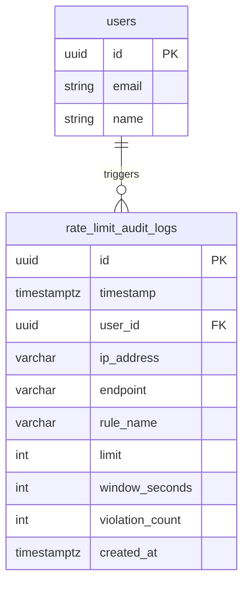

# Rate Limiting Audit Trail

Comprehensive documentation of the rate limiting audit system, including database schema, audit flow, and query patterns.

---

## Overview

The rate limiting audit system provides a permanent, queryable record of all rate limit violations. This immutable audit trail supports security analysis, compliance reporting, and attack pattern detection.

### Why This Approach?

PostgreSQL-based audit logging provides:

- **Queryability**: SQL analytics for violation patterns and trends
- **Permanence**: Immutable records with foreign key relationships
- **Compliance**: TIMESTAMPTZ fields meet PCI-DSS requirements
- **Fail-Open**: Audit failures never block requests
- **Security**: Track both authenticated (user_id) and anonymous (IP) requests

## Context

The audit system operates as part of the rate limiting bounded context, logging violations after rate limit checks fail. All audit operations are:

- Asynchronous (non-blocking)
- Fail-open (errors logged, not raised)
- Per-request (fresh database session)
- Timezone-aware (UTC timestamps)

## Architecture Goals

- **Immutability**: No updates or deletes allowed (audit integrity)
- **Queryability**: Support security analysis and compliance reporting
- **Performance**: Async writes never block rate limit enforcement
- **Reliability**: Fail-open design prevents audit from creating outages
- **Compliance**: Full timezone awareness (TIMESTAMPTZ for all timestamps)

## Design Decisions

### Decision 1: PostgreSQL Over Logs

**Rationale:** Structured database records enable complex queries for security analysis and compliance reporting.

**Alternatives Considered:**

- **Application logs only**: Not queryable, no retention guarantees (rejected)
- **Redis with TTL**: Data loss on eviction unacceptable for audit (rejected)
- **Time-series database**: Overkill for current scale, less familiar (rejected)

**Trade-offs:**

- ✅ Pros: SQL queries, indexes, joins with users table, permanent storage
- ✅ Pros: Standard database backup/restore procedures
- ⚠️ Cons: Additional write load (mitigated by async + fail-open)

### Decision 2: Per-Request Database Sessions

**Rationale:** Fresh session per violation avoids session lifecycle issues and shared state problems.

**Alternatives Considered:**

- **Shared session**: Session lifecycle conflicts with middleware flow (rejected)
- **Session pool**: Added complexity without benefit (rejected)

**Trade-offs:**

- ✅ Pros: Clean session lifecycle, no shared state, simple error handling
- ✅ Pros: Each audit operation isolated (no cross-contamination)
- ⚠️ Cons: Session creation overhead (~1ms, acceptable for violations only)

### Decision 3: Fail-Open at All Layers

**Rationale:** Audit failures must never block legitimate requests or create denial-of-service.

**Trade-offs:**

- ✅ Pros: System remains operational despite audit failures
- ✅ Pros: Database outages don't cause cascading failures
- ⚠️ Cons: Some violations may not be recorded (acceptable trade-off)

## Components

### Audit System Flow

```mermaid
flowchart LR
    Request[Rate Limited<br/>Request] --> Middleware[Middleware<br/>_audit_violation]
    
    Middleware --> Parse[Parse Identifier]
    Parse --> UserID{user: or ip:?}
    
    UserID -->|user:uuid| ExtractUser[Extract UUID]
    UserID -->|ip:address| ExtractIP[Extract IP]
    
    ExtractUser --> Session[Get Fresh<br/>DB Session]
    ExtractIP --> Session
    
    Session --> Backend[DatabaseAuditBackend]
    Backend --> Create[Create<br/>RateLimitAuditLog]
    Create --> Insert[INSERT INTO<br/>rate_limit_audit_logs]
    Insert --> Commit[session.commit]
    
    Commit --> Success[Audit Logged]
    
    Backend -.->|Error| FailOpen[Log Error<br/>Don't Raise]
    FailOpen -.-> Success
    
    Success --> Return429[Return HTTP 429]
    
    style Request fill:#ffcdd2
    style Success fill:#c8e6c9
    style FailOpen fill:#fff9c4
```



### Database Schema



### Component 1: RateLimitAuditLog Model

**Purpose:** SQLModel representing immutable audit trail records.

**Fields:**

- `id` (UUID): Primary key, indexed
- `timestamp` (TIMESTAMPTZ): When violation occurred, indexed
- `user_id` (UUID, nullable): Foreign key to users table, indexed
- `ip_address` (VARCHAR(45)): Client IP (IPv4 or IPv6), indexed
- `endpoint` (VARCHAR(255)): Rate limited endpoint, indexed
- `rule_name` (VARCHAR(100)): Rate limit rule violated
- `limit` (INTEGER): Max requests allowed
- `window_seconds` (INTEGER): Time window in seconds
- `violation_count` (INTEGER): Requests over limit (default: 1)
- `created_at` (TIMESTAMPTZ): Record creation time

**Validators:**

- `ensure_timezone_aware`: Ensures all datetime fields are UTC

**Constraints:**

- Foreign key: `user_id` → `users.id` (CASCADE delete)
- Indexes: id, timestamp, user_id, ip_address, endpoint

### Component 2: DatabaseAuditBackend

**Purpose:** Strategy pattern implementation for PostgreSQL audit logging.

**Responsibilities:**

- Create RateLimitAuditLog records
- Extract user_id from "user:{uuid}" identifiers
- Extract ip_address from "ip:{address}" identifiers
- Handle database errors gracefully (fail-open)
- Log structured events for observability

**Error Handling:**

```python
try:
    # Create and persist audit log
    audit_log = RateLimitAuditLog(...)
    self.session.add(audit_log)
    await self.session.commit()
    logger.info("Rate limit violation logged", extra={...})
except Exception as e:
    # Fail-open: Log error but don't raise
    logger.error(f"Failed to log violation: {e}", exc_info=True)
```

### Component 3: AuditBackend Interface

**Purpose:** Strategy pattern abstraction for pluggable audit destinations.

**Interface:**

```python
class AuditBackend(ABC):
    @abstractmethod
    async def log_violation(
        self,
        ip_address: str,
        endpoint: str,
        rule_name: str,
        limit: int,
        window_seconds: int,
        violation_count: int,
        user_id: Optional[UUID] = None,
        timestamp: Optional[datetime] = None,
    ) -> None:
        """Log rate limit violation."""
        pass
```

**Future Implementations:**

- CloudWatch Logs
- Splunk
- ELK Stack
- Datadog

## Implementation Details

### Identifier Parsing

The middleware parses identifiers to extract user_id and ip_address:

```python
# Example identifiers:
"user:123e4567-e89b-12d3-a456-426614174000"  # Authenticated request
"ip:192.168.1.100"                            # Unauthenticated request
"ip:2001:0db8:85a3::8a2e:0370:7334"         # IPv6 request
```

Parsing logic:

```python
if identifier.startswith("user:"):
    user_id_str = identifier.replace("user:", "")
    user_id = UUID(user_id_str)
    ip_address = "unknown"  # Not available for user-scoped
elif identifier.startswith("ip:"):
    ip_address = identifier.replace("ip:", "")
    user_id = None
```

### Database Session Management

Per-request session pattern:

```python
async def _audit_violation(self, identifier, endpoint, rule):
    # Create fresh session for this violation
    from src.core.database import get_session
    
    async for session in get_session():
        backend = DatabaseAuditBackend(session)
        await backend.log_violation(...)
        break  # Use first (and only) session
```

### Timezone Awareness

All timestamps stored as UTC:

```python
@field_validator("timestamp", "created_at", mode="before")
@classmethod
def ensure_timezone_aware(cls, v: Optional[datetime]) -> Optional[datetime]:
    if v is None:
        return None
    if v.tzinfo is None:
        return v.replace(tzinfo=timezone.utc)
    return v.astimezone(timezone.utc)
```

## Security Considerations

### Threats Addressed

- **Attack Pattern Detection**: Query logs for repeated violations from same IP
- **Account Compromise**: Track violations per user_id for anomaly detection
- **Compliance**: Permanent audit trail for regulatory requirements
- **Forensics**: Complete record of rate limit enforcement

### Security Best Practices

- **Immutable Records**: No UPDATE or DELETE operations allowed
- **Foreign Key Cascade**: Audit logs deleted when user deleted (GDPR compliance)
- **Indexed Queries**: Fast lookups by IP, user_id, endpoint, timestamp
- **UTC Timestamps**: Timezone-aware for global compliance (PCI-DSS)

## Performance Considerations

### Performance Characteristics

- **Write Latency**: ~5-10ms per INSERT (async, non-blocking)
- **Storage**: ~200 bytes per record
- **Query Performance**: Indexed fields support fast lookups
- **Impact on Rate Limiting**: Zero (async + fail-open)

### Optimization Strategies

- **Async Writes**: Never block rate limit enforcement
- **Batch Inserts**: Future enhancement for high-volume scenarios
- **Partition Tables**: Future enhancement for scaling (by month)
- **Index Maintenance**: Regular ANALYZE for query performance

## Query Patterns

### Common Security Queries

**Find violations by IP:**

```sql
SELECT * FROM rate_limit_audit_logs
WHERE ip_address = '203.0.113.42'
ORDER BY timestamp DESC
LIMIT 100;
```

**Find violations by user:**

```sql
SELECT * FROM rate_limit_audit_logs
WHERE user_id = '123e4567-e89b-12d3-a456-426614174000'
ORDER BY timestamp DESC;
```

**Find violations by endpoint:**

```sql
SELECT endpoint, COUNT(*) as violation_count
FROM rate_limit_audit_logs
WHERE timestamp > NOW() - INTERVAL '1 hour'
GROUP BY endpoint
ORDER BY violation_count DESC;
```

**Attack pattern detection:**

```sql
-- Find IPs with many violations (potential attack)
SELECT ip_address, COUNT(*) as violations
FROM rate_limit_audit_logs
WHERE timestamp > NOW() - INTERVAL '1 day'
GROUP BY ip_address
HAVING COUNT(*) > 100
ORDER BY violations DESC;
```

**Time range analysis:**

```sql
SELECT DATE_TRUNC('hour', timestamp) as hour,
       COUNT(*) as violations
FROM rate_limit_audit_logs
WHERE timestamp BETWEEN '2025-10-26 00:00:00+00' 
                    AND '2025-10-26 23:59:59+00'
GROUP BY hour
ORDER BY hour;
```

## Testing Strategy

### Unit Tests

- ✅ `test_log_violation_success`: Basic audit log creation
- ✅ `test_log_violation_with_authenticated_user`: Foreign key relationship
- ✅ `test_log_violation_without_user_id`: Unauthenticated requests
- ✅ `test_log_violation_fail_open_on_database_error`: Error handling
- ✅ `test_log_violation_timezone_aware_timestamps`: UTC enforcement
- ✅ `test_log_violation_ipv6_address`: IPv6 support

### Integration Tests

- Middleware + Audit: Verify violations logged on HTTP 429
- Multi-Endpoint: Independent audit logs per endpoint
- User Deletion: Cascade delete verification

## Future Enhancements

- **Batch Writes**: Buffer violations for bulk insert (high volume)
- **Table Partitioning**: Monthly partitions for scaling
- **Archival**: Move old logs to cold storage (S3)
- **Dashboard**: Admin UI for viewing violations
- **Alerting**: Automated alerts on attack patterns
- **Export**: CSV/JSON export for external analysis

## References

- [Rate Limiting Architecture](architecture.md)
- [Rate Limiting Request Flow](request-flow.md)
- [Rate Limiting Observability](observability.md)
- [Database Migrations](../../docs/development/infrastructure/database-migrations.md)

---

## Document Information

**Created:** 2025-10-26
**Last Updated:** 2025-10-26
