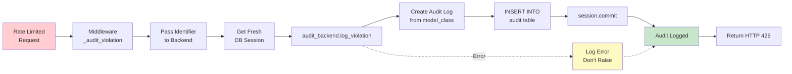

# Rate Limiter Audit Trail

Comprehensive documentation of the Rate Limiter audit system, including audit backend architecture, database-agnostic design, and query patterns.

---

## Overview

The Rate Limiter audit system provides a permanent, queryable record of all rate limit violations. This immutable audit trail supports security analysis, compliance reporting, and attack pattern detection.

### Why This Approach?

Database audit logging provides:

- **Queryability**: SQL analytics for violation patterns and trends
- **Permanence**: Immutable records with proper relationships
- **Compliance**: Timezone-aware timestamps meet regulatory requirements
- **Fail-Open**: Audit failures never block requests
- **Security**: Track both authenticated and unauthenticated requests
- **Flexibility**: Database-agnostic design works with any storage backend

## Context

The audit system operates as part of the Rate Limiter bounded context, logging violations after rate limit checks fail. All audit operations are:

- Asynchronous (non-blocking)
- Fail-open (errors logged, not raised)
- Per-request (fresh database session)
- Timezone-aware (UTC timestamps)

## Architecture Goals

- **Immutability**: No updates or deletes allowed (audit integrity)
- **Queryability**: Support security analysis and compliance reporting
- **Performance**: Async writes never block rate limit enforcement
- **Reliability**: Fail-open design prevents audit from creating outages
- **Compliance**: Full timezone awareness (TIMESTAMPTZ for all timestamps)
- **Flexibility**: Database-agnostic interface enables multiple implementations

## Design Decisions

### Decision 1: Database Over Logs

**Rationale:** Structured database records enable complex queries for security analysis and compliance reporting.

**Alternatives Considered:**

- **Application logs only**: Not queryable, no retention guarantees (rejected)
- **Redis with TTL**: Data loss on eviction unacceptable for audit (rejected)
- **Time-series database**: Overkill for current scale, less familiar (rejected)

**Trade-offs:**

- ✅ Pros: SQL queries, indexes, permanent storage
- ✅ Pros: Standard database backup/restore procedures
- ⚠️ Cons: Additional write load (mitigated by async + fail-open)

### Decision 2: Database-Agnostic Design

**Rationale:** Abstract model interface enables multiple database implementations without changing package code.

**Alternatives Considered:**

- **PostgreSQL-only implementation**: Tightly coupled, limits adoption (rejected)
- **SQLAlchemy core**: Too low-level, loses type safety (rejected)

**Trade-offs:**

- ✅ Pros: Application defines concrete models with native types (INET, UUID)
- ✅ Pros: Package remains database-agnostic and reusable
- ✅ Pros: No foreign key constraints in package (optional in app)
- ⚠️ Cons: Application must implement concrete model (acceptable trade-off)

### Decision 3: Identifier Field (No User FK)

**Rationale:** Package doesn't manage users, application controls identifier format and relationships.

**Alternatives Considered:**

- **user_id foreign key**: Couples package to application user table (rejected)
- **Separate user_id and ip_address fields**: Package shouldn't dictate user relationship (rejected)

**Trade-offs:**

- ✅ Pros: Complete decoupling from application user management
- ✅ Pros: Application controls identifier format ("user:uuid", "ip:address", "session:token")
- ✅ Pros: Package reusable across different authentication systems
- ⚠️ Cons: Application must parse identifiers for queries (acceptable trade-off)

### Decision 4: Per-Request Database Sessions

**Rationale:** Fresh session per violation avoids session lifecycle issues and shared state problems.

**Alternatives Considered:**

- **Shared session**: Session lifecycle conflicts with middleware flow (rejected)
- **Session pool**: Added complexity without benefit (rejected)

**Trade-offs:**

- ✅ Pros: Clean session lifecycle, no shared state, simple error handling
- ✅ Pros: Each audit operation isolated (no cross-contamination)
- ⚠️ Cons: Session creation overhead (~1ms, acceptable for violations only)

### Decision 5: Fail-Open at All Layers

**Rationale:** Audit failures must never block legitimate requests or create denial-of-service.

**Trade-offs:**

- ✅ Pros: System remains operational despite audit failures
- ✅ Pros: Database outages don't cause cascading failures
- ⚠️ Cons: Some violations may not be recorded (acceptable trade-off)

## Components

### Audit System Flow



### Component 1: AuditLogModelInterface (Abstract Base)

**Purpose:** Defines minimum interface for audit log models, implemented by application.

**Required Attributes:**

- `id` (UUID): Primary key, indexed
- `timestamp` (DateTime): When violation occurred, indexed, timezone-aware
- `identifier` (str): Rate limit identifier (format controlled by application)
- `endpoint` (str): Rate limited endpoint, indexed
- `rule_name` (str): Rate limit rule violated
- `limit` (int): Max requests allowed
- `window_seconds` (int): Time window in seconds
- `violation_count` (int): Requests over limit (default: 1)
- `created_at` (DateTime): Record creation time, timezone-aware

**Validators:**

- `ensure_timezone_aware`: Ensures all datetime fields are UTC

**Example Implementations:**

**PostgreSQL with Native Types:**

```python
from sqlmodel import Field
from sqlalchemy import Column
from sqlalchemy.dialects.postgresql import INET
from src.rate_limiter.audit import AuditLogModelInterface

class RateLimitAuditLog(AuditLogModelInterface, table=True):
    __tablename__ = "rate_limit_audit_logs"
    
    # Use native INET type for IP addresses
    identifier: str = Field(sa_column=Column(INET, nullable=False, index=True))
    
    # Optional: Add foreign key to users if application manages user relationships
    # user_id: Optional[UUID] = Field(foreign_key="users.id", index=True)
```

**MySQL with VARCHAR:**

```python
from sqlmodel import Field
from src.rate_limiter.audit import AuditLogModelInterface

class RateLimitAuditLog(AuditLogModelInterface, table=True):
    __tablename__ = "rate_limit_audit_logs"
    
    # Use VARCHAR for identifier
    identifier: str = Field(max_length=255, nullable=False, index=True)
```

**Flexibility:**

- Application defines concrete model with database-specific types
- Package works with any model implementing the interface
- Application controls foreign keys, indexes, and constraints

### Component 2: DatabaseAuditBackend

**Purpose:** Strategy pattern implementation for database audit logging.

**Responsibilities:**

- Create audit log records using application-provided model class
- Store identifier without parsing (application controls format)
- Handle database errors gracefully (fail-open)
- Log structured events for observability

**Constructor:**

```python
def __init__(
    self,
    session: AsyncSession,
    model_class: Type[AuditLogModelInterface]
)
```

**Key Method:**

```python
async def log_violation(
    self,
    identifier: str,  # Format controlled by application
    endpoint: str,
    rule_name: str,
    limit: int,
    window_seconds: int,
    violation_count: int,
    timestamp: Optional[datetime] = None,
) -> None
```

**Error Handling:**

```python
try:
    # Create and persist audit log
    audit_log = self.model_class(
        identifier=identifier,
        endpoint=endpoint,
        rule_name=rule_name,
        limit=limit,
        window_seconds=window_seconds,
        violation_count=violation_count,
        timestamp=timestamp or datetime.now(timezone.utc),
    )
    self.session.add(audit_log)
    await self.session.commit()
    logger.info("Rate limit violation logged", extra={...})
except Exception as e:
    # Fail-open: Log error but don't raise
    logger.error(f"Failed to log violation: {e}", exc_info=True)
```

### Component 3: AuditBackend Interface

**Purpose:** Strategy pattern abstraction for pluggable audit destinations.

**Interface:**

```python
class AuditBackend(ABC):
    @abstractmethod
    async def log_violation(
        self,
        identifier: str,
        endpoint: str,
        rule_name: str,
        limit: int,
        window_seconds: int,
        violation_count: int,
        timestamp: Optional[datetime] = None,
    ) -> None:
        """Log rate limit violation."""
        pass
```

**Future Implementations:**

- CloudWatch Logs
- Splunk
- ELK Stack
- Datadog
- Custom application-specific backends

## Implementation Details

### Application Integration

The application provides the concrete model class when initializing the service:

```python
from src.rate_limiter import RateLimiterService, DatabaseAuditBackend
from src.models.audit import RateLimitAuditLog  # Application's concrete model

# Initialize with application's model class
audit_backend = DatabaseAuditBackend(
    session=db_session,
    model_class=RateLimitAuditLog
)

service = RateLimiterService(
    storage=redis_storage,
    config=rate_limit_config,
    audit_backend=audit_backend
)
```

### Identifier Format

The package stores identifiers as-is without parsing. Application controls the format:

```python
# Example identifier formats (application-defined):
"user:123e4567-e89b-12d3-a456-426614174000"  # Authenticated user
"ip:192.168.1.100"                            # Unauthenticated IP
"session:abc123def456"                        # Session-based
"api_key:prod_key_xyz"                        # API key-based
```

**Querying by Identifier:**

Application parses identifiers when querying:

```python
# Find violations by user
user_violations = await session.execute(
    select(RateLimitAuditLog)
    .where(RateLimitAuditLog.identifier.like("user:123e4567%"))
    .order_by(RateLimitAuditLog.timestamp.desc())
)

# Find violations by IP
ip_violations = await session.execute(
    select(RateLimitAuditLog)
    .where(RateLimitAuditLog.identifier == "ip:192.168.1.100")
    .order_by(RateLimitAuditLog.timestamp.desc())
)
```

### Database Session Management

Per-request session pattern:

```python
async def _audit_violation(self, identifier, endpoint, rule):
    # Create fresh session for this violation
    async for session in get_session():
        backend = DatabaseAuditBackend(
            session=session,
            model_class=RateLimitAuditLog
        )
        await backend.log_violation(
            identifier=identifier,
            endpoint=endpoint,
            rule_name=rule.name,
            limit=rule.limit,
            window_seconds=rule.window_seconds,
            violation_count=1
        )
        break  # Use first (and only) session
```

### Timezone Awareness

All timestamps stored as UTC:

```python
@field_validator("timestamp", "created_at", mode="before")
@classmethod
def ensure_timezone_aware(cls, v: Optional[datetime]) -> Optional[datetime]:
    if v is None:
        return None
    if v.tzinfo is None:
        return v.replace(tzinfo=timezone.utc)
    return v.astimezone(timezone.utc)
```

## Security Considerations

### Threats Addressed

- **Attack Pattern Detection**: Query logs for repeated violations from same identifier
- **Account Compromise**: Track violations per user identifier for anomaly detection
- **Compliance**: Permanent audit trail for regulatory requirements
- **Forensics**: Complete record of rate limit enforcement

### Security Best Practices

- **Immutable Records**: No UPDATE or DELETE operations allowed
- **Optional Foreign Keys**: Application controls user relationships for GDPR compliance
- **Indexed Queries**: Fast lookups by identifier, endpoint, timestamp
- **UTC Timestamps**: Timezone-aware for global compliance
- **IP Sanitization**: Invalid IPs (e.g., "testclient") converted to "127.0.0.1"

## Performance Considerations

### Performance Characteristics

- **Write Latency**: ~5-10ms per INSERT (async, non-blocking)
- **Storage**: ~200 bytes per record
- **Query Performance**: Indexed fields support fast lookups
- **Impact on Rate Limiter**: Zero (async + fail-open)

### Optimization Strategies

- **Async Writes**: Never block rate limit enforcement
- **Batch Inserts**: Future enhancement for high-volume scenarios
- **Partition Tables**: Future enhancement for scaling (by month)
- **Index Maintenance**: Regular ANALYZE for query performance

## Query Patterns

### Common Security Queries

**Find violations by identifier:**

```sql
SELECT * FROM rate_limit_audit_logs
WHERE identifier = 'ip:203.0.113.42'
ORDER BY timestamp DESC
LIMIT 100;
```

**Find violations by user:**

```sql
SELECT * FROM rate_limit_audit_logs
WHERE identifier LIKE 'user:123e4567%'
ORDER BY timestamp DESC;
```

**Find violations by endpoint:**

```sql
SELECT endpoint, COUNT(*) as violation_count
FROM rate_limit_audit_logs
WHERE timestamp > NOW() - INTERVAL '1 hour'
GROUP BY endpoint
ORDER BY violation_count DESC;
```

**Attack pattern detection:**

```sql
-- Find identifiers with many violations (potential attack)
SELECT identifier, COUNT(*) as violations
FROM rate_limit_audit_logs
WHERE timestamp > NOW() - INTERVAL '1 day'
GROUP BY identifier
HAVING COUNT(*) > 100
ORDER BY violations DESC;
```

**Time range analysis:**

```sql
SELECT DATE_TRUNC('hour', timestamp) as hour,
       COUNT(*) as violations
FROM rate_limit_audit_logs
WHERE timestamp BETWEEN '2025-10-26 00:00:00+00' 
                    AND '2025-10-26 23:59:59+00'
GROUP BY hour
ORDER BY hour;
```

## Testing Strategy

### Unit Tests (with Mocks)

- ✅ `test_log_violation_success`: Basic audit log creation
- ✅ `test_log_violation_with_identifier`: Identifier storage without parsing
- ✅ `test_log_violation_fail_open_on_database_error`: Error handling
- ✅ `test_log_violation_timezone_aware_timestamps`: UTC enforcement
- ✅ `test_log_violation_with_custom_violation_count`: Violation count tracking

### Integration Tests (with Real Database)

- PostgreSQL-specific implementation tests
- Verify concrete model with native types (INET)
- Verify foreign key relationships (if application adds them)
- Verify cascade delete behavior (if application adds foreign keys)

### API Tests (End-to-End)

- Middleware + Audit: Verify violations logged on HTTP 429
- Multi-Endpoint: Independent audit logs per endpoint
- Identifier Parsing: Verify application can query by parsed identifiers

## Future Enhancements

- **Batch Writes**: Buffer violations for bulk insert (high volume)
- **Table Partitioning**: Monthly partitions for scaling
- **Archival**: Move old logs to cold storage (S3)
- **Dashboard**: Admin UI for viewing violations
- **Alerting**: Automated alerts on attack patterns
- **Export**: CSV/JSON export for external analysis

## References

- [Rate Limiter Architecture](architecture.md)
- [Rate Limiter Request Flow](request-flow.md)
- [Rate Limiter Observability](observability.md)

---

## Document Information

**Created:** 2025-10-26
**Last Updated:** 2025-10-31
