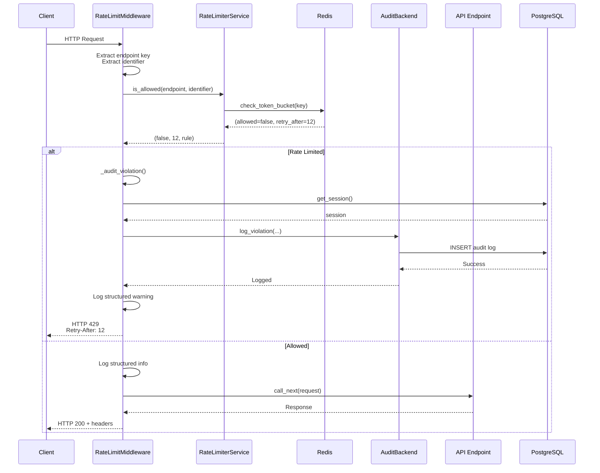
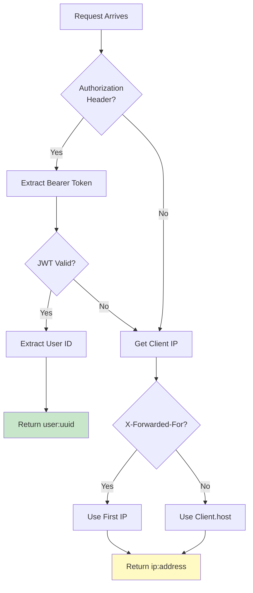
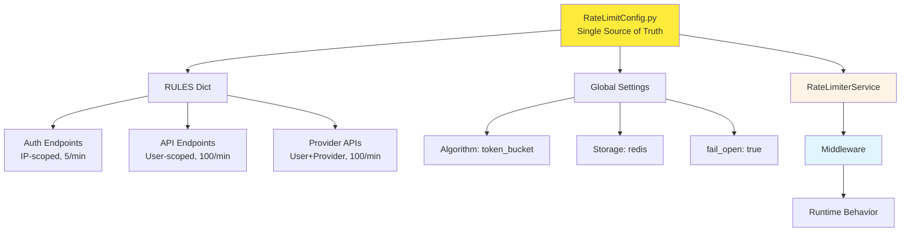
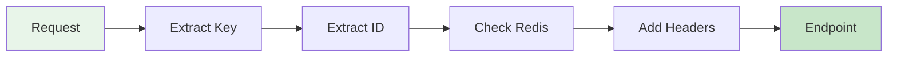
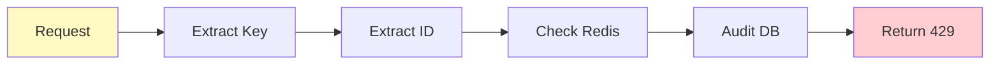
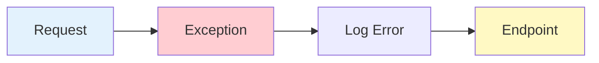

# Rate Limiting Request Flow

Complete documentation of HTTP request lifecycle through the rate limiting system, from client request to final response.

---

## Overview

This document details the complete request flow through the rate limiting middleware, including identifier extraction, rate limit checks, audit logging, and response generation. Understanding this flow is essential for debugging, monitoring, and extending the system.

### Why This Matters

The request flow determines:

- **Performance**: Total latency from rate limit check (~5ms overhead)
- **Security**: When and how violations are detected and logged
- **User Experience**: Response times and error messages
- **Observability**: Where and what gets logged for monitoring

## Context

Every HTTP request to the Dashtam API passes through the RateLimitMiddleware before reaching endpoint handlers. The middleware:

1. Extracts endpoint key and identifier
2. Checks rate limits via service layer
3. Returns HTTP 429 if rate limited (with audit log)
4. Passes request to endpoint if allowed (with headers)
5. Fails open on any errors (never blocks requests)

## Request Lifecycle

### Complete Request Flow



## Flow Stages

### Stage 1: Request Reception

**Entry Point:** `RateLimitMiddleware.dispatch()`

#### Actions

1. Middleware receives incoming HTTP request
2. Lazy initialization of rate limiter service (first request only)
3. Error handling wrapper activated (fail-open)

#### Code

```python
async def dispatch(self, request: Request, call_next: Callable) -> Response:
    try:
        rate_limiter = await self._get_rate_limiter()
        # ... continue flow
    except Exception as e:
        logger.error(f"Rate limit middleware failed: {e}")
        return await call_next(request)  # Fail-open
```

**Timing:** <1ms (lazy init cached after first request)

### Stage 2: Endpoint Key Extraction

**Method:** `_get_endpoint_key()`

#### Actions

1. Extract HTTP method and path
2. Normalize UUIDs to placeholders (`{provider_id}`)
3. Build key format: `"METHOD /path"`

#### Examples

- `POST /api/v1/auth/login` → `"POST /api/v1/auth/login"`
- `GET /api/v1/providers/123e4567-...` → `"GET /api/v1/providers/{provider_id}"`

#### Code

```python
def _get_endpoint_key(self, request: Request) -> str:
    method = request.method
    path = request.url.path
    
    # Replace UUID path parameters with placeholders
    uuid_pattern = r"[0-9a-f]{8}-[0-9a-f]{4}-[0-9a-f]{4}-[0-9a-f]{4}-[0-9a-f]{12}"
    if re.search(uuid_pattern, path):
        # Normalize UUIDs to {provider_id}, etc.
        path = self._normalize_path(path)
    
    return f"{method} {path}"
```

**Timing:** <0.5ms

### Stage 3: Identifier Extraction

**Method:** `_get_identifier()`

#### Actions

1. Try to extract user ID from JWT access token
2. Validate token signature and expiration
3. Fall back to IP address if no valid token
4. Handle proxy headers (X-Forwarded-For)

#### Decision Tree



#### Code

```python
async def _get_identifier(self, request: Request) -> str:
    try:
        user_id = await self._extract_user_id_from_token(request)
        if user_id:
            return user_id  # Format: "user:{uuid}"
    except Exception:
        pass  # Fall back to IP
    
    return self._get_client_ip(request)  # Format: "ip:{address}"
```

**Timing:** ~1-2ms (JWT validation)

### Stage 4: Rate Limit Check

**Method:** `RateLimiterService.is_allowed()`

#### Actions

1. Look up rate limit rule for endpoint
2. Build storage key based on scope
3. Call algorithm via storage backend
4. Measure execution time
5. Log structured event

#### Storage Key Building

- **IP scope**: `"ip:{ip_address}:{endpoint}"`
- **User scope**: `"user:{user_id}:{endpoint}"`
- **User-Provider scope**: `"user_provider:{user_id}:{provider}:{endpoint}"`

#### Redis Operation

```lua
-- token_bucket.lua (atomic)
local bucket = redis.call('HGETALL', key)
local now = tonumber(ARGV[1])

-- Calculate refill
local tokens, last_refill = parse_bucket(bucket)
local elapsed = now - last_refill
local tokens_to_add = elapsed * refill_rate
tokens = math.min(tokens + tokens_to_add, max_tokens)

-- Check if allowed
if tokens >= cost then
    tokens = tokens - cost
    redis.call('HSET', key, 'tokens', tokens, 'last_refill', now)
    return {1, 0}  -- allowed
else
    local retry_after = cost / refill_rate
    return {0, retry_after}  -- denied
end
```

**Timing:** 2-3ms (Redis Lua execution)

### Stage 5A: Rate Limited Path

**Triggered When:** `allowed == false`

#### Actions

1. Create HTTP 429 response with headers
2. Audit violation to database (async)
3. Log structured warning event
4. Return response to client

#### Response Headers

```http
HTTP/1.1 429 Too Many Requests
Retry-After: 12
X-RateLimit-Limit: 5
X-RateLimit-Remaining: 0
X-RateLimit-Reset: 12
```

#### Response Body

```json
{
    "error": "Rate limit exceeded",
    "message": "Too many requests. Please try again in 12 seconds.",
    "retry_after": 12,
    "endpoint": "POST /api/v1/auth/login"
}
```

#### Audit Logging

1. Parse identifier to extract user_id and ip_address
2. Create fresh database session
3. Call `DatabaseAuditBackend.log_violation()`
4. Insert into `rate_limit_audit_logs` table
5. Fail-open on any errors

**Timing:** ~5-10ms (async audit write)

### Stage 5B: Allowed Path

**Triggered When:** `allowed == true`

#### Actions

1. Log structured info event
2. Call next middleware/endpoint handler
3. Wait for response
4. Add rate limit headers to response
5. Return response to client

#### Response Headers

```http
HTTP/1.1 200 OK
X-RateLimit-Limit: 100
X-RateLimit-Remaining: 87
X-RateLimit-Reset: 60
```

#### Code

```python
# Allowed: proceed to endpoint
response = await call_next(request)

# Add rate limit headers
if rule:
    await self._add_rate_limit_headers(
        response, rule, endpoint_key, identifier, rate_limiter
    )

return response
```

**Timing:** <1ms (header addition)

### Stage 6: Error Handling (Fail-Open)

**Triggered When:** Any exception occurs in middleware

#### Actions

1. Log error with full context
2. Allow request to proceed
3. Return response from endpoint

#### Code

```python
except Exception as e:
    logger.error(
        f"Rate limit middleware failed: {e}. "
        f"Allowing request (fail-open)."
    )
    return await call_next(request)
```

**Philosophy:** Rate limiter failures should never cause denial-of-service.

## Configuration Flow

### Single Source of Truth (SSOT)



#### Configuration Lookup

```python
# In RateLimitConfig
RULES = {
    "POST /api/v1/auth/login": RateLimitRule(
        scope="ip",
        max_tokens=5,
        refill_rate=5.0,  # per minute
    ),
    # ... more rules
}

# In RateLimiterService
rule = RateLimitConfig.get_rule(endpoint_key)
if rule is None:
    return (True, 0.0, None)  # No rate limiting
```

## Performance Characteristics

### Latency Breakdown

| Stage | Operation | Latency (p95) | Notes |
|-------|-----------|---------------|-------|
| 1 | Middleware entry | <0.1ms | Cached after first request |
| 2 | Endpoint key extraction | <0.5ms | Regex UUID normalization |
| 3 | Identifier extraction | 1-2ms | JWT validation overhead |
| 4 | Rate limit check | 2-3ms | Redis Lua execution |
| 5A | Audit logging | 5-10ms | Async, non-blocking |
| 5B | Header addition | <1ms | Redis GET for remaining |
| **Total (allowed)** | **~5ms** | **Sub-10ms p95** | *Overall allowed path* |
| **Total (blocked)** | **~8ms** | **With audit write** | *Overall blocked path* |

### Request Paths

#### Hot Path (Allowed)



**Total:** ~5ms overhead

#### Cold Path (Rate Limited)



**Total:** ~8ms (with async audit)

#### Error Path (Fail-Open)



**Total:** <1ms (minimal overhead)

## Security Considerations

### Attack Scenarios

**Scenario 1: Brute Force Attack:**

1. Attacker sends 100 login attempts to `/api/v1/auth/login`
2. First 5 requests allowed (within 5/min limit)
3. Requests 6-100 return HTTP 429
4. Each violation logged to audit table
5. Security team queries logs to identify attacking IPs

**Scenario 2: API Abuse:**

1. Malicious user with valid JWT hammers API endpoints
2. User-scoped limit (100/min) enforced
3. Violations logged with user_id
4. Account can be suspended based on violation count

**Scenario 3: DDoS Attempt:**

1. Distributed attack from many IPs
2. Each IP limited independently (IP scope)
3. Legitimate users on different IPs unaffected
4. Audit logs show attack pattern (many IPs, same endpoint)

### Security Headers

**X-RateLimit-*** headers inform clients:

- `X-RateLimit-Limit`: Total requests allowed
- `X-RateLimit-Remaining`: Requests left in window
- `X-RateLimit-Reset`: Seconds until full reset

**Retry-After** header (RFC 6585):

- Tells client when to retry
- Prevents thundering herd on reset

## Monitoring and Alerts

### Key Metrics

#### From Structured Logs

- `rate_limit.allowed` - Requests allowed count
- `rate_limit.blocked` - Requests blocked count
- `rate_limit.execution_time_ms` - Check latency histogram
- `rate_limit.fail_open` - Fail-open events (alert on spikes)

#### From Audit Logs (Database)

- Violation count by endpoint
- Violation count by IP address
- Violation count by user_id
- Violations per hour/day (trending)

### Alert Conditions

#### Critical Alerts

- Fail-open events > 10/min (rate limiter degraded)
- Audit write failures > 10/min (database issues)
- Execution time > 50ms p95 (Redis slow)

#### Warning Alerts

- Single IP > 1000 violations/hour (potential attack)
- Single user > 500 violations/hour (abuse)
- Violations > 10,000/hour globally (DDoS attempt)

## Testing Strategy

### Unit Tests

- Endpoint key extraction with UUID normalization
- Identifier extraction with JWT validation
- Rate limit response generation
- Header addition logic

### Integration Tests

- Complete request flow (allowed)
- Complete request flow (rate limited)
- Fail-open behavior verification
- Audit log creation on violations

### Load Tests

- 1000 req/s sustained load (check latency)
- Burst scenarios (token bucket capacity)
- Fail-open under Redis failure

## Troubleshooting

### Common Issues

**Issue 1: Rate limits not enforced:**

- Check: Is middleware registered in main.py?
- Check: Does endpoint key match config RULES?
- Check: Is Redis reachable?

**Issue 2: False positives (legitimate users blocked):**

- Review: Are limits too restrictive?
- Check: Token bucket configuration (burst capacity)
- Verify: Identifier extraction (user vs IP)

**Issue 3: Audit logs not created:**

- Check: Database connectivity
- Check: Alembic migration applied
- Check: Structured logs for errors

## References

- [Rate Limiting Architecture](architecture.md)
- [Rate Limiting Audit Trail](audit.md)
- [Rate Limiting Observability](observability.md)
- [Token Bucket Algorithm](https://en.wikipedia.org/wiki/Token_bucket)
- [RFC 6585 (429 Status Code)](https://tools.ietf.org/html/rfc6585)

---

## Document Information

**Created:** 2025-10-26
**Last Updated:** 2025-10-26
