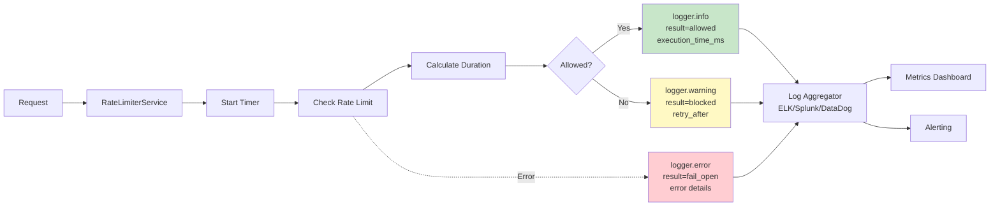
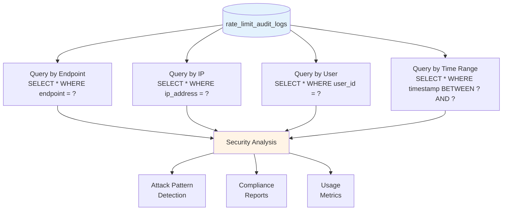

# Rate Limiting Observability

Comprehensive guide to monitoring, logging, metrics, and alerting for the rate limiting system.

---

## Overview

The rate limiting system provides rich observability through structured logging, database audit trails, and performance metrics. This enables real-time monitoring, attack detection, and system health analysis.

### Why Observability Matters

Proper observability enables:

- **Early Detection**: Identify attacks and abuse patterns in real-time
- **Performance Monitoring**: Track latency and throughput degradation
- **Capacity Planning**: Understand usage patterns for scaling decisions
- **Incident Response**: Debug issues quickly with rich context
- **Compliance**: Demonstrate rate limit enforcement for audits

## Context

The rate limiting system generates observability data from three sources:

1. **Structured Logs**: Real-time events with rich context (Python logging)
2. **Audit Database**: Permanent violation records (PostgreSQL)
3. **Performance Metrics**: Latency and throughput measurements

All sources follow fail-open design - observability failures never block requests.

## Logging Architecture

### Logging & Metrics Flow



### Structured Logging Levels

**DEBUG Level:**

```python
logger.debug(
    "No rate limit configured for endpoint",
    extra={"endpoint": endpoint_key}
)
```

**INFO Level (Allowed):**

```python
logger.info(
    f"Rate limit check: endpoint={endpoint_key}, "
    f"identifier={identifier}, result=allowed",
    extra={
        "endpoint": endpoint_key,
        "identifier": identifier,
        "rule_name": rule.name,
        "cost": cost,
        "limit": rule.max_tokens,
        "window_seconds": rule.window_seconds,
        "execution_time_ms": execution_time,
        "result": "allowed",
    }
)
```

**WARNING Level (Blocked):**

```python
logger.warning(
    f"Rate limit exceeded: endpoint={endpoint_key}, "
    f"identifier={identifier}, retry_after={retry_after:.2f}s",
    extra={
        "endpoint": endpoint_key,
        "identifier": identifier,
        "rule_name": rule.name,
        "cost": cost,
        "limit": rule.max_tokens,
        "window_seconds": rule.window_seconds,
        "retry_after": retry_after,
        "execution_time_ms": execution_time,
        "result": "blocked",
    }
)
```

**ERROR Level (Fail-Open):**

```python
logger.error(
    f"Rate limit check failed: {e}. Failing open (allowing request).",
    extra={
        "endpoint": endpoint_key,
        "identifier": identifier,
        "error": str(e),
        "result": "fail_open",
    },
    exc_info=True,  # Include stack trace
)
```

### Log Context Fields

| Field | Type | Description | Example |
|-------|------|-------------|---------|
| `endpoint` | str | Normalized endpoint key | `"POST /api/v1/auth/login"` |
| `identifier` | str | User ID or IP address | `"user:123e4567..."` or `"ip:192.168.1.1"` |
| `rule_name` | str | Rate limit rule applied | `"auth_login"` |
| `cost` | int | Tokens consumed | `1` |
| `limit` | int | Max tokens allowed | `5` |
| `window_seconds` | int | Time window | `60` |
| `execution_time_ms` | float | Check latency | `2.5` |
| `result` | str | Decision outcome | `"allowed"` / `"blocked"` / `"fail_open"` |
| `retry_after` | float | Seconds until retry | `12.0` |
| `error` | str | Error message (if failed) | `"Redis connection timeout"` |

## Metrics

### Key Performance Indicators

**Request Metrics:**

- `rate_limit_checks_total` - Total rate limit checks (counter)
- `rate_limit_allowed_total` - Requests allowed (counter)
- `rate_limit_blocked_total` - Requests blocked (counter)
- `rate_limit_fail_open_total` - Fail-open events (counter)

**Latency Metrics:**

- `rate_limit_check_duration_ms` - Check latency (histogram)
  - p50, p95, p99 percentiles
  - By endpoint, by rule
- `rate_limit_audit_duration_ms` - Audit write latency (histogram)

**Violation Metrics:**

- `rate_limit_violations_by_endpoint` - Violations per endpoint (gauge)
- `rate_limit_violations_by_ip` - Violations per IP (gauge)
- `rate_limit_violations_by_user` - Violations per user (gauge)

### Metric Aggregation

**From Structured Logs:**

```python
# Example log aggregation query (ELK/Splunk)
{
  "query": {
    "bool": {
      "must": [
        {"match": {"result": "blocked"}},
        {"range": {"@timestamp": {"gte": "now-1h"}}}
      ]
    }
  },
  "aggs": {
    "violations_by_endpoint": {
      "terms": {"field": "endpoint"}
    }
  }
}
```

**From Audit Database:**

```sql
-- Violations per hour (last 24 hours)
SELECT 
    DATE_TRUNC('hour', timestamp) as hour,
    COUNT(*) as violations
FROM rate_limit_audit_logs
WHERE timestamp > NOW() - INTERVAL '24 hours'
GROUP BY hour
ORDER BY hour;
```

## Audit Trail Query Patterns

### Common Analysis Queries

**Find top attacking IPs:**

```sql
SELECT 
    ip_address,
    COUNT(*) as violations,
    COUNT(DISTINCT endpoint) as endpoints_hit,
    MIN(timestamp) as first_seen,
    MAX(timestamp) as last_seen
FROM rate_limit_audit_logs
WHERE timestamp > NOW() - INTERVAL '1 day'
GROUP BY ip_address
HAVING COUNT(*) > 100
ORDER BY violations DESC
LIMIT 50;
```

**Identify abusive users:**

```sql
SELECT 
    u.email,
    u.id as user_id,
    COUNT(*) as violations,
    STRING_AGG(DISTINCT ral.endpoint, ', ') as endpoints
FROM rate_limit_audit_logs ral
JOIN users u ON ral.user_id = u.id
WHERE ral.timestamp > NOW() - INTERVAL '1 day'
GROUP BY u.id, u.email
HAVING COUNT(*) > 500
ORDER BY violations DESC;
```

**Attack pattern timeline:**

```sql
SELECT 
    DATE_TRUNC('minute', timestamp) as minute,
    endpoint,
    COUNT(*) as violations,
    COUNT(DISTINCT ip_address) as unique_ips
FROM rate_limit_audit_logs
WHERE timestamp BETWEEN '2025-10-26 12:00:00+00' 
                    AND '2025-10-26 13:00:00+00'
GROUP BY minute, endpoint
ORDER BY minute, violations DESC;
```

**Rule effectiveness analysis:**

```sql
SELECT 
    rule_name,
    COUNT(*) as total_violations,
    COUNT(DISTINCT ip_address) as unique_ips,
    COUNT(DISTINCT user_id) as unique_users,
    AVG(violation_count) as avg_requests_over_limit
FROM rate_limit_audit_logs
WHERE timestamp > NOW() - INTERVAL '7 days'
GROUP BY rule_name
ORDER BY total_violations DESC;
```

### Audit Trail Query Patterns Diagram



## Dashboards

### Real-Time Monitoring Dashboard

**Overview Panel:**

- Total requests/min (live)
- Allowed vs blocked rate (%)
- Fail-open events (alert on > 0)
- Average check latency (ms)

**Endpoint Breakdown:**

- Requests per endpoint (top 10)
- Violations per endpoint (top 10)
- Average latency per endpoint

**Attack Detection:**

- Top violating IPs (last hour)
- Top violating users (last hour)
- Violation rate trend (last 24h)

**System Health:**

- Redis latency (p95, p99)
- Audit write latency (p95, p99)
- Fail-open event count (alert threshold)

### Example Dashboard Query (Grafana/Prometheus)

```promql
# Rate of blocked requests
rate(rate_limit_blocked_total[5m])

# Check latency p95
histogram_quantile(0.95, rate(rate_limit_check_duration_ms_bucket[5m]))

# Fail-open events (alert on any)
increase(rate_limit_fail_open_total[5m]) > 0
```

## Alerting Strategy

### Alert Severity Levels

**Critical (PagerDuty):**

- Fail-open rate > 10/min for 5 minutes
- Audit write failures > 50/min for 5 minutes
- Rate limit check latency p95 > 100ms for 10 minutes
- Redis connection failures detected

**Warning (Slack/Email):**

- Single IP > 1000 violations/hour
- Single user > 500 violations/hour
- Global violations > 10,000/hour
- Rate limit check latency p95 > 50ms for 10 minutes

**Info (Dashboard):**

- New attacking IPs detected (> 100 violations/hour)
- Unusual endpoint traffic patterns
- Rate limit rules nearing capacity

### Alert Configuration Examples

**PagerDuty Alert (Fail-Open):**

```yaml
alert: RateLimiterFailOpen
expr: rate(rate_limit_fail_open_total[5m]) > 10
for: 5m
severity: critical
annotations:
  summary: "Rate limiter fail-open events detected"
  description: "{{ $value }} fail-open events/min in last 5 minutes"
  runbook: "https://docs.example.com/runbooks/rate-limiter-fail-open"
```

**Slack Alert (Attack Detection):**

```yaml
alert: PotentialDDoSAttack
expr: rate(rate_limit_blocked_total[1m]) > 10000
for: 5m
severity: warning
annotations:
  summary: "High rate of violations detected"
  description: "{{ $value }} violations/min - possible DDoS attack"
  dashboard: "https://grafana.example.com/rate-limiting"
```

## Monitoring Integration

### Log Aggregation Systems

**ELK Stack (Elasticsearch, Logstash, Kibana):**

```json
{
  "logstash_pipeline": {
    "filter": {
      "if": "[logger] == 'rate_limiting'",
      "mutate": {
        "add_tag": ["rate_limit"],
        "convert": {
          "execution_time_ms": "float",
          "retry_after": "float"
        }
      }
    }
  }
}
```

**Splunk:**

```spl
index=application logger=rate_limiting
| stats count by result
| eval label = case(
    result=="allowed", "Allowed",
    result=="blocked", "Blocked", 
    result=="fail_open", "Fail-Open"
  )
```

**Datadog:**

```python
# Custom metric emission
statsd.histogram('rate_limit.check.duration', execution_time_ms)
statsd.increment('rate_limit.blocked', tags=[f'endpoint:{endpoint}'])
```

### Application Performance Monitoring (APM)

**New Relic:**

- Custom transaction tracking for rate limit checks
- Error rate monitoring (fail-open events)
- Distributed tracing through middleware

**Datadog APM:**

- Automatic middleware instrumentation
- Trace sampling for blocked requests
- Service map visualization

**AWS CloudWatch:**

- Custom metrics via EMF (Embedded Metric Format)
- Log Insights queries for analysis
- Metric alarms for fail-open events

## Performance Monitoring

### Latency Tracking

**Execution Time Measurement:**

```python
start_time = time.perf_counter()

# Perform rate limit check
allowed, retry_after, rule = await rate_limiter.is_allowed(...)

# Calculate duration
execution_time = (time.perf_counter() - start_time) * 1000  # ms

logger.info(
    "Rate limit check completed",
    extra={"execution_time_ms": execution_time, ...}
)
```

**Latency Percentiles:**

- p50: ~2ms (typical case)
- p95: ~3ms (with some network variance)
- p99: ~5ms (occasional Redis slowness)
- p99.9: ~10ms (Redis under load)

**Alert Thresholds:**

- p95 > 50ms: Warning (potential Redis degradation)
- p95 > 100ms: Critical (investigate immediately)

### Throughput Monitoring

**Requests Per Second:**

```python
# Calculate from structured logs
rate = count(rate_limit_checks) / time_window_seconds

# Track by endpoint
rps_by_endpoint = {
    "POST /api/v1/auth/login": 45,
    "GET /api/v1/providers": 234,
    # ...
}
```

**Capacity Planning:**

- Current: 1000 req/s per instance (with Redis)
- Target: 5000 req/s per instance (Redis Cluster)
- Scale trigger: Sustained > 800 req/s for 10 minutes

## Troubleshooting Workflows

### Issue 1: High Latency

**Symptoms:**

- p95 latency > 50ms
- User reports of slow responses
- Dashboard shows increased check duration

**Investigation:**

1. Check Redis latency: `redis-cli --latency`
2. Review structured logs for `execution_time_ms`
3. Check Redis CPU and memory usage
4. Review network latency to Redis

**Resolution:**

- Scale Redis (more CPU/memory)
- Optimize Lua scripts
- Enable Redis persistence tuning
- Consider Redis Cluster for distribution

### Issue 2: Fail-Open Events

**Symptoms:**

- Fail-open counter increasing
- Error logs showing exceptions
- Rate limiting not enforcing

**Investigation:**

1. Check error logs for exception details
2. Verify Redis connectivity: `redis-cli PING`
3. Check database connectivity (for audit)
4. Review service health metrics

**Resolution:**

- Restart Redis if hung
- Fix network connectivity issues
- Scale database if overloaded
- Review application error logs

### Issue 3: False Positives

**Symptoms:**

- Legitimate users reporting 429 errors
- Audit logs show excessive violations
- User complaints about access

**Investigation:**

1. Query audit logs for user/IP patterns
2. Review rate limit rules (too restrictive?)
3. Check if token bucket properly configured
4. Verify identifier extraction (user vs IP)

**Resolution:**

- Adjust rate limit thresholds
- Increase burst capacity (max_tokens)
- Review scope (IP vs user vs user_provider)
- Whitelist specific users/IPs if needed

## Compliance and Reporting

### Regulatory Requirements

**PCI-DSS:**

- ✅ Audit trail with UTC timestamps (TIMESTAMPTZ)
- ✅ Immutable logs (no UPDATE/DELETE)
- ✅ Indexed for fast queries
- ✅ Foreign key relationships (user_id)

**GDPR:**

- ✅ Cascade delete (user deletion removes audit logs)
- ✅ Queryable by user_id for data exports
- ✅ Retention policies supported (date-based cleanup)

**SOC 2:**

- ✅ Complete audit trail of rate limit enforcement
- ✅ Monitoring and alerting on abuse
- ✅ Incident response workflows
- ✅ Regular security analysis

### Reporting Queries

**Monthly Security Report:**

```sql
SELECT 
    DATE_TRUNC('day', timestamp) as day,
    COUNT(*) as total_violations,
    COUNT(DISTINCT ip_address) as unique_ips,
    COUNT(DISTINCT user_id) FILTER (WHERE user_id IS NOT NULL) as unique_users
FROM rate_limit_audit_logs
WHERE timestamp > DATE_TRUNC('month', CURRENT_DATE)
GROUP BY day
ORDER BY day;
```

**Endpoint Protection Report:**

```sql
SELECT 
    endpoint,
    COUNT(*) as violations_blocked,
    COUNT(DISTINCT ip_address) as attacking_ips,
    AVG(violation_count) as avg_requests_over_limit
FROM rate_limit_audit_logs
WHERE timestamp > NOW() - INTERVAL '30 days'
GROUP BY endpoint
ORDER BY violations_blocked DESC;
```

## References

- [Rate Limiting Architecture](architecture.md)
- [Rate Limiting Audit Trail](audit.md)
- [Rate Limiting Request Flow](request-flow.md)
- [Grafana Dashboard Examples](https://grafana.com/docs/grafana/latest/)
- [ELK Stack Documentation](https://www.elastic.co/guide/index.html)

---

## Document Information

**Created:** 2025-10-26
**Last Updated:** 2025-10-26
